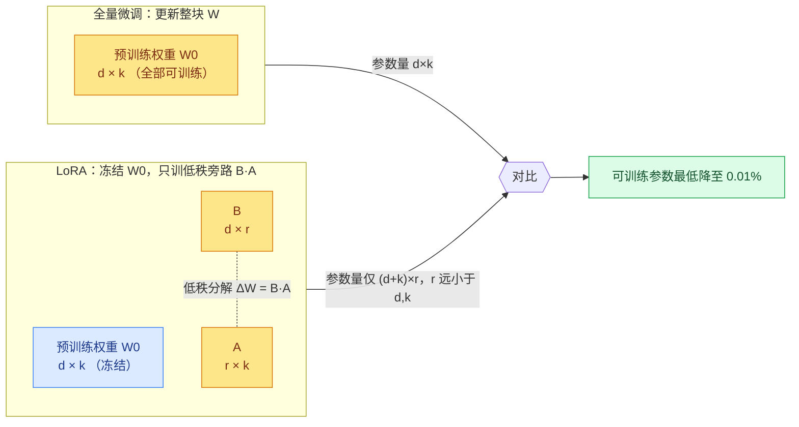
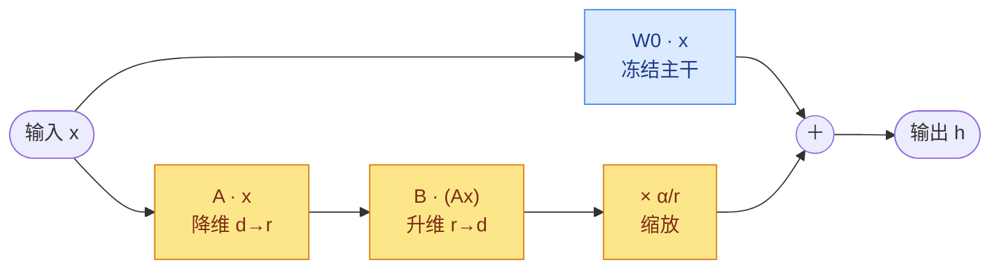
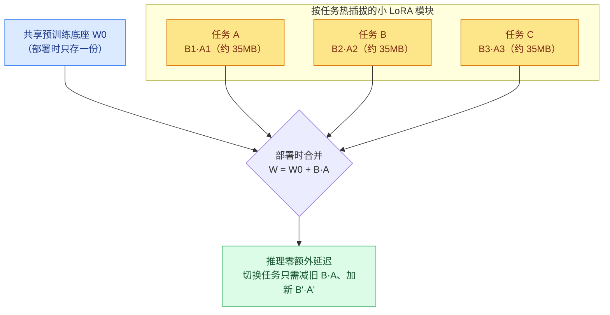

# 《LoRA: Low-Rank Adaptation of Large Language Models》解读报告

> **论文标题**：LoRA: Low-Rank Adaptation of Large Language Models（大语言模型的低秩适配）
> **作者团队**：Edward Hu、Yelong Shen、Phillip Wallis、Zeyuan Allen-Zhu、Yuanzhi Li、Shean Wang、Lu Wang、Weizhu Chen（Microsoft Corporation）
> **出处**：arXiv:2106.09685v2 \[cs.CL]，2021 年 10 月（Version 2，发表于 ICLR 2022）
> **开源地址**：<https://github.com/microsoft/LoRA>

***

## 一、研究背景

NLP 的主流范式是"通用领域大规模预训练 + 下游任务适配"。最常见的适配方式是 **全量微调（full fine-tuning）**:用预训练权重初始化，再对 **所有参数** 做梯度更新。但随着模型越来越大，全量微调的代价变得难以承受——以 GPT-3 175B 为例，每个下游任务都要存储一份 175B 参数的独立副本，部署成本高到几乎不可行。

学界已有多种"参数高效适配"思路，但都存在明显短板：

| 技术路线                  | 代表工作                                                                         | 核心局限                                                                                                        |
| --------------------- | ---------------------------------------------------------------------------- | ----------------------------------------------------------------------------------------------------------- |
| **Adapter 层**         | Houlsby et al. 2019、Lin et al. 2020                                          | 在 Transformer 块中插入额外层，**串行计算无法被硬件并行掩盖**,引入推理延迟（batch=1 的在线场景尤其明显，见 Tab.1）;模型分片时还需额外的 AllReduce/Broadcast 同步 |
| **Prefix / Prompt 类** | Prefix-tuning（Li & Liang 2021）、Prompt-tuning（Lester 2021）、P-tuning（Liu 2021） | **难以优化**,性能随可训练参数非单调变化;占用输入序列长度，挤压了下游任务可用的上下文                                                               |
| **只训部分参数 / BitFit**   | Zaken et al. 2021                                                            | 常常 **达不到全量微调的精度**,在效率与质量间被迫取舍                                                                               |

**核心动机与灵感**：Li et al.(2018a) 与 Aghajanyan et al.(2020) 发现——过参数化模型实际上"驻留在一个低内在维度（low intrinsic dimension）"的子空间上。作者由此 **假设**:模型在适配过程中，权重的 **变化量** **$\Delta W$** **也具有很低的"内在秩"（intrinsic rank）**。如果这个假设成立，就可以只学习一个低秩的更新量，而不必动用全部参数。

## 二、核心思路

LoRA（Low-Rank Adaptation，低秩适配）的设计哲学：**冻结预训练权重，把"权重更新量"约束为低秩分解，只训练这两个小矩阵。**

对预训练权重矩阵 $W_0\in\mathbb{R}^{d\times k}$,不直接更新它，而是用一个低秩分解来表示它的更新量：

$W_0+\Delta W = W_0 + BA,\qquad B\in\mathbb{R}^{d\times r},\ A\in\mathbb{R}^{r\times k},\ r\ll\min(d,k)$

训练时 $W_0$ 完全冻结、不接收梯度，只有 $A$ 和 $B$ 是可训练的。由于秩 $r$ 远小于 $d$ 和 $k$,可训练参数量被大幅压缩。作者证明：即使 GPT-3 的满秩高达 $d=12{,}288$,把 $r$ 取到 1 或 2 往往就够用。

*概念图：全量微调更新整块 $W$（$d\times k$ 个参数）；LoRA 冻结 $W_0$，只训练低秩旁路 $B\in\mathbb{R}^{d\times r}$ 与 $A\in\mathbb{R}^{r\times k}$，参数量从 $d\times k$ 降为 $(d+k)\times r$，因 $r\ll\min(d,k)$ 而大幅压缩。*

这一设计带来四个关键优势:① 一个共享的预训练底座 + 多个小 LoRA 模块，**切换任务只需替换** **$A,B$**;② 不需为冻结参数维护优化器状态，**显存门槛降低约 3 倍**;③ 线性结构允许部署时把 $BA$ 合并进 $W_0$,**推理零额外延迟**;④ 与 prefix-tuning 等方法 **正交**,可组合使用。

## 三、核心技术点与架构

*图注 (Fig.1)：LoRA 的重参数化（reparametrization）。输入* *$x$* *同时流经两条路径——冻结的预训练权重* *$W_0\in\mathbb{R}^{d\times d}$（蓝色，不更新）与可训练的旁路* *$BA$。旁路先用* *$A$* *把维度从* *$d$* *降到* *$r$，再用* *$B$* *升回* *$d$，两路输出按坐标相加得到* *$h$。初始化时* *$A\sim\mathcal{N}(0,\sigma^2)$、$B=0$，使训练起点* *$\Delta W=BA=0$。只有* *$A$、$B$* *被训练。*

### 3.1 问题形式化

全量微调最大化条件语言建模目标，需要学习一个与 $|\Phi_0|$ 等维的更新量 $\Delta\Phi$:

$\max_{\Phi}\ \sum_{(x,y)\in\mathcal{Z}}\ \sum_{t=1}^{|y|}\ \log\big(P_{\Phi}(y_t\mid x,y_{<t})\big)$

LoRA 改为用一组小得多的参数 $\Theta$（$|\Theta|\ll|\Phi_0|$）来编码增量 $\Delta\Phi=\Delta\Phi(\Theta)$,优化目标变为：

$\max_{\Theta}\ \sum_{(x,y)\in\mathcal{Z}}\ \sum_{t=1}^{|y|}\ \log\big(p_{\Phi_0+\Delta\Phi(\Theta)}(y_t\mid x,y_{<t})\big)$

当底座是 GPT-3 175B 时，可训练参数 $|\Theta|$ 可低至 $|\Phi_0|$ 的 **0.01%**。

### 3.2 前向计算与初始化/缩放

对原本的 $h=W_0x$,LoRA 修改后的前向传播为：

$h = W_0x + \Delta Wx = W_0x + BAx$

* **初始化**:$A$ 用随机高斯，$B$ 置零，因此 $\Delta W=BA$ 在训练开始时为零，不扰动预训练模型。

* **缩放**:把 $\Delta Wx$ 乘以 $\frac{\alpha}{r}$,其中 $\alpha$ 是关于 $r$ 的常数。用 Adam 优化时，调 $\alpha$ 大致等价于调学习率;作者直接把 $\alpha$ 设为首次尝试的 $r$ 值、不再调它，从而在改变 $r$ 时减少超参重调。

*前向计算：$h=W_0x+\frac{\alpha}{r}BAx$。蓝色主干 $W_0$ 冻结，黄色旁路 $A,B$ 可训练。初始化时 $A\sim\mathcal{N}(0,\sigma^2)$、$B=0$，故起点 $\Delta W=BA=0$，不扰动预训练模型。*

### 3.3 全量微调的泛化

LoRA 是全量微调的一种泛化：当把 LoRA 应用到 **所有** 权重矩阵、并让秩 $r$ 增大到预训练权重矩阵的满秩时，可大致恢复全量微调的表达能力。相比之下，adapter 类方法在参数增多时收敛到一个 MLP,prefix 类方法收敛到一个无法处理长输入的模型——这是 LoRA 的结构性优势。

### 3.4 应用到 Transformer

Transformer 自注意力模块有 4 个权重矩阵 $W_q,W_k,W_v,W_o$,MLP 模块有 2 个。论文 **只对注意力权重做 LoRA，冻结 MLP**,兼顾简洁与参数效率。带来的实际收益（GPT-3 175B）:

* 训练显存（VRAM）从 **1.2TB 降到 350GB**（$r\ll d_{model}$ 时省去冻结参数的优化器状态，最多省 2/3）;

* 取 $r=4$ 且只适配 $W_q,W_v$ 时，checkpoint 从 **350GB 缩到 35MB，约 10,000×**;

* 训练吞吐相比全量微调 **提速约 25%**（无需为绝大多数参数算梯度）。

**局限**:若把 $A,B$ 合并进 $W$ 以消除延迟，则难以在单次前向里对不同任务（不同 $A,B$）的输入做 batch;但在延迟不敏感场景可不合并、动态选择 LoRA 模块。

## 四、创新点总结

| # | 创新点            | 说明                                                                                         |
| - | -------------- | ------------------------------------------------------------------------------------------ |
| 1 | **低秩更新假设与方法**  | 假设适配时权重更新 $\Delta W$ 具有低内在秩，用 $\Delta W=BA$ 低秩分解约束更新，冻结 $W_0$ 只训 $A,B$                    |
| 2 | **推理零额外延迟**    | 线性结构使 $W=W_0+BA$ 可在部署时合并，推理与全量微调完全一致;切换任务只需减旧 $BA$、加新 $B'A'$                              |
| 3 | **极致的参数/显存效率** | 可训练参数最低降至 0.01%,GPT-3 上 checkpoint 缩小 10,000×、显存降 3×、训练提速 25%                              |
| 4 | **与其他方法正交**    | 可与 prefix-tuning 等组合;是全量微调的泛化（增大 $r$ 趋近全量微调）                                               |
| 5 | **低秩性的实证解释**   | 通过子空间相似度（Grassmann 距离）与 $\Delta W$-$W$ 关联分析，验证"秩极低即够用",并揭示 $\Delta W$ 放大了 $W$ 中未被强调的任务相关特征 |

*服务化部署：一个冻结底座 $W_0$ 搭配多个仅约 35MB 的 LoRA 模块。线性结构使 $W=W_0+BA$ 可在部署时合并，推理与全量微调完全一致（零额外延迟）；切换任务只需减去旧 $BA$、加上新 $B'A'$。*

## 五、实验与效果对比

覆盖 RoBERTa、DeBERTa、GPT-2 到 GPT-3 175B，任务涵盖 NLU（GLUE）与 NLG（E2E、WikiSQL、SAMSum 等）。下表均重排自论文，**加粗为同组最优或关键值**。

### 5.1 推理延迟（Tab.1，GPT-2 medium，单位 ms）

Adapter 因串行计算引入显著延迟，LoRA 合并后与全量微调一致（故同列）:

| 场景（Batch / SeqLen） | Fine-Tune/LoRA | AdapterL       | AdapterH       |
| ------------------ | -------------- | -------------- | -------------- |
| 32 / 512           | **1449.4**     | 1482.0 (+2.2%) | 1492.2 (+3.0%) |
| 16 / 256           | **338.0**      | 354.8 (+5.0%)  | 366.3 (+8.4%)  |
| 1 / 128（在线短序列）     | **19.8**       | 23.9 (+20.7%)  | 25.8 (+30.3%)  |

### 5.2 GLUE 上的 NLU（Tab.2，节选 Avg.）

| 模型 & 方法            | 可训练参数    | GLUE 平均  |
| ------------------ | -------- | -------- |
| RoBbase（全量微调）\*    | 125.0M   | 86.4     |
| RoBbase（AdptD）\*   | 0.9M     | 85.4     |
| **RoBbase（LoRA）**  | **0.3M** | **87.2** |
| RoBlarge（全量微调）\*   | 355.0M   | 88.9     |
| **RoBlarge（LoRA）** | **0.8M** | **89.0** |
| DeBXXL（全量微调）\*     | 1500.0M  | 91.1     |
| **DeBXXL（LoRA）**   | **4.7M** | **91.3** |

LoRA 用不到 1% 的可训练参数，达到甚至略超全量微调。

### 5.3 GPT-2 上的 NLG（Tab.3，E2E NLG Challenge）

| 方法                  | 可训练参数     | BLEU     | NIST     | MET      | ROUGE-L  | CIDEr    |
| ------------------- | --------- | -------- | -------- | -------- | -------- | -------- |
| GPT-2 M（全量微调）\*     | 354.92M   | 68.2     | 8.62     | 46.2     | 71.0     | 2.47     |
| GPT-2 M（PreLayer）\* | 0.35M     | 69.7     | 8.81     | 46.1     | 71.4     | 2.49     |
| **GPT-2 M（LoRA）**   | **0.35M** | **70.4** | **8.85** | **46.8** | **71.8** | **2.53** |

同等或更少参数下，LoRA 在全部 5 项指标上领先。

### 5.4 GPT-3 175B (Tab.4)

| 方法              | 可训练参数      | WikiSQL Acc.% | MNLI-m Acc.% | SAMSum R1/R2/RL    |
| --------------- | ---------- | ------------- | ------------ | ------------------ |
| GPT-3（全量微调）     | 175,255.8M | 73.8          | 89.5         | 52.0/28.0/44.5     |
| GPT-3（PreEmbed） | 3.2M       | 63.1          | 88.6         | 48.3/24.2/40.5     |
| GPT-3（AdapterH） | 40.1M      | 73.2          | 91.5         | 53.2/29.0/45.1     |
| **GPT-3（LoRA）** | **4.7M**   | **73.4**      | **91.7**     | **53.8/29.8/45.9** |
| **GPT-3（LoRA）** | 37.7M      | **74.0**      | 91.6         | 53.4/29.2/45.1     |

LoRA 仅用 4.7M 参数（约为全量微调的 0.027%）即全面追平或超越全量微调。

*图注 (Fig.2)：GPT-3 175B 验证准确率 vs. 可训练参数量（横轴为* *$\log_{10}$* *参数量）在 WikiSQL（左）与 MNLI-matched（右）上的曲线。LoRA 展现更好的可扩展性与任务性能；而 prefix 类方法非单调——prefix-embedding 超过 256 个特殊 token、prefix-layer 超过 32 个 token 后性能显著下滑（作者推测过多特殊 token 使输入分布偏离预训练分布）。*

### 5.5 低秩性的深入分析（Section 7）

**(a) 该适配哪些权重矩阵？（Tab.5，参数预算固定 18M）**

| 权重类型     | $W_q$ | $W_v$ | $W_o$ | $W_q,W_k$ | $W_q,W_v$ | $W_q,W_k,W_v,W_o$ |
| -------- | ------ | ------ | ------ | ----------- | ----------- | --------------------- |
| 秩 $r$    | 8      | 8      | 8      | 4           | 4           | 2                     |
| WikiSQL  | 70.4   | 73.0   | 73.2   | 71.4        | **73.7**    | **73.7**              |
| MultiNLI | 91.0   | 91.0   | 91.3   | 91.3        | 91.3        | **91.7**              |

结论：在同等参数预算下，**同时适配** **$W_q,W_v$** **优于把参数集中在单一类型**——即便每个矩阵只有 $r=4$,也比单类型大秩更划算。

**(b) 最优秩** **$r$** **是多少？（Tab.6）**

| 权重类型                            | $r=1$    | $r=2$ | $r=4$ | $r=8$    | $r=64$ |
| ------------------------------- | -------- | ----- | ----- | -------- | ------ |
| WikiSQL — $W_q,W_v$           | 73.4     | 73.3  | 73.7  | **73.8** | 73.5   |
| WikiSQL — $W_q,W_k,W_v,W_o$ | **74.1** | 73.7  | 74.0  | 74.0     | 73.9   |
| MultiNLI — $W_q,W_v$          | 91.3     | 91.4  | 91.3  | **91.6** | 91.4   |

令人惊讶的是：适配 ${W_q,W_v}$ 时 **$r=1$** **就已极具竞争力**,$r$ 增大几乎无增益，说明 $\Delta W$ 的内在秩确实极低。

**(c) 子空间相似度 (Fig.3)**：用基于 Grassmann 距离的归一化子空间相似度衡量 $A_{r=8}$ 与 $A_{r=64}$ 的重叠：

$\phi(A_{r=8},A_{r=64},i,j)=\frac{\lVert U_{A_{r=8}}^{i\top}U_{A_{r=64}}^{j}\rVert_F^2}{\min(i,j)}\in\[0,1]$

发现：**top 奇异向量方向在** **$r=8$** **与** **$r=64$** **间高度重叠（相似度 >0.5）,其余方向几乎不重叠**——这解释了为何 $r=1$ 就够用：增大 $r$ 并未覆盖更有意义的子空间，多出的方向多是训练累积的随机噪声。

**(d)** **$\Delta W$** **与** **$W$** **的关系（Tab.7，GPT-3 第 48 层）**：把 $W$ 投影到 $\Delta W$ 的 $r$ 维子空间，比较 Frobenius 范数：

|                                 | $r=4$：$\Delta W_q$ / $W_q$ / 随机 | $r=64$：$\Delta W_q$ / $W_q$ / 随机 |
| ------------------------------------ | --------------------------------- | ---------------------------------- |
| $\lVert U^\top W_q V^\top\rVert_F$ | 0.32 / 21.67 / 0.02               | 1.90 / 37.71 / 0.33                |

其中 $\lVert W_q\rVert_F=61.95$,$\lVert\Delta W_q\rVert_F=6.91$（$r=4$）。三点结论:① $\Delta W$ 与 $W$ 的相关性强于随机矩阵，说明它放大了 $W$ 中已有的特征;② 它放大的是 $W$ 中 **未被强调** 的方向，而非重复 top 奇异方向;③ 放大因子很大，$r=4$ 时约 $6.91/0.32\approx21.5$。这表明 **低秩适配放大了那些预训练时已学到、但未被强调的、对特定下游任务重要的特征**。

## 六、结论与展望

**结论**：全量微调巨型语言模型在硬件与"每任务一份独立副本"的存储/切换成本上代价高昂。LoRA 提出一种高效适配策略——**冻结预训练权重、只训低秩更新矩阵**,既不引入推理延迟、也不缩短输入序列，同时保持高模型质量，并支持服务化部署时的快速任务切换。虽然论文聚焦 Transformer 语言模型，但该原理适用于任何含稠密层的神经网络。实验贯穿 RoBERTa / DeBERTa / GPT-2 / GPT-3，在远少于全量微调的参数下持平或超越;分析部分则从子空间相似度与 $\Delta W$-$W$ 关联两个角度，实证了"适配更新本质低秩"。

**未来工作（作者列出）**：① LoRA 与其他高效适配方法组合，可能带来正交增益;② 借助 LoRA 更易研究"预训练特征如何转化为下游能力"的微调机理;③ 目前靠启发式选择适配哪些权重矩阵，期待更有原则的方法;④ $\Delta W$ 的秩亏缺暗示 $W$ 本身可能也秩亏缺，这本身是后续研究的灵感来源。

***

### 附：报告配图说明

本报告配图从论文 PDF 提取，存于 `2106.09685v2_assets/` 目录：

* `crop_page1_c1.png` — **Fig.1（精准裁剪）**：LoRA 重参数化结构图，page 1 bbox `0.635,0.66,0.93,0.825`（归一化坐标）。

* `crop_page8_c2.png` — **Fig.2（精准裁剪）**：GPT-3 175B 上各适配方法"准确率 vs. 参数量"的可扩展性曲线，page 8 bbox `0.10,0.55,0.93,0.82`。

* `crop_page11_c2.png` — **Fig.3（精准裁剪，备用）**：$A_{r=8}$ 与 $A_{r=64}$ 的子空间相似度热力图，page 11 bbox `0.08,0.15,0.92,0.52`。

**说明**：论文的图（Fig.1–4）均为 **矢量绘制**,`get_images()` 提取出的 `fig_page*.png` 仅是字形/坐标轴碎片（尺寸如 16×129、16×216 像素，非完整图）。本报告使用 **精准裁剪**（`--crop` + 归一化 bbox）提取图形区域并高清渲染（zoom=3.5），避免整页渲染中的大片留白与无关文本。所有数值（参数量、GLUE/E2E/WikiSQL/MNLI/SAMSum 指标、10,000×、显存 1.2TB→350GB、放大因子 21.5、范数 61.95/6.91 等）与公式均直接取自论文正文，未作推断。

---

## 🔗 相关笔记

- [[02.资料分类/AI研究/Finetuning/大模型微调笔记：对比LoRA、QLoRA、AdaLoRA、LoRA+\|大模型微调笔记：对比LoRA、QLoRA、AdaLoRA、LoRA+]] — LoRA 的工程化变体(QLoRA/AdaLoRA/LoRA+)横向对比
- [[02.资料分类/AI工程/开源大模型训练、微调与部署框架深度研究报告：核心技术、优缺分析及国产芯片适配选型\|开源大模型训练、微调与部署框架深度研究报告：核心技术、优缺分析及国产芯片适配选型]] — LoRA 在 LLaMA-Factory/Unsloth 等框架中的落地实现
- [[知识图谱与索引\|知识图谱与索引]] — 返回全局知识地图
