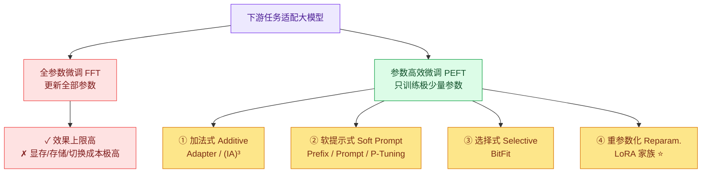
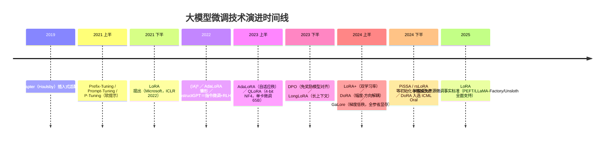
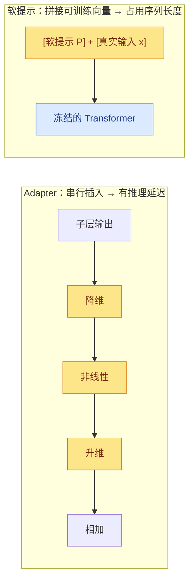
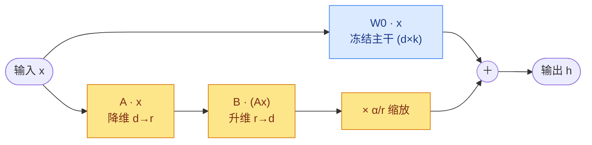
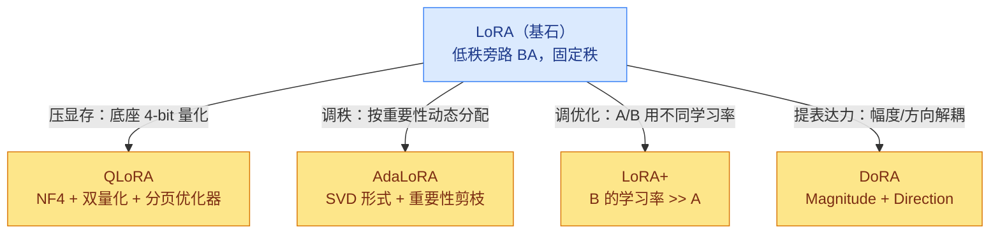
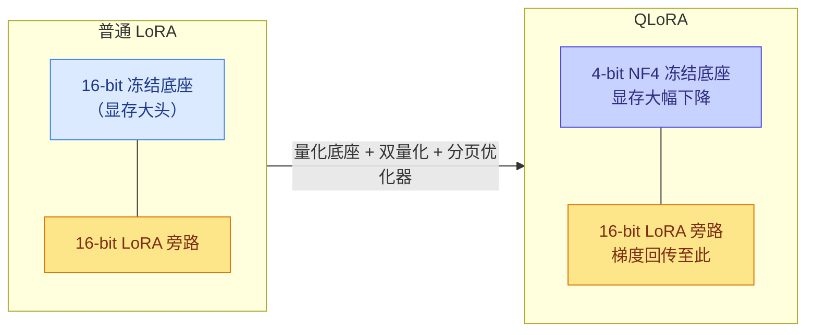
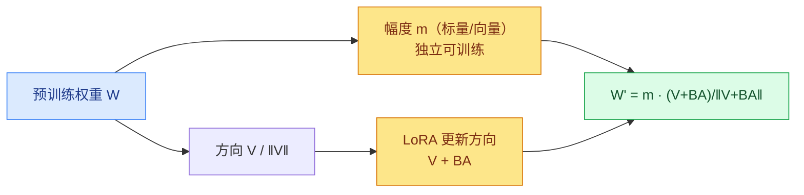
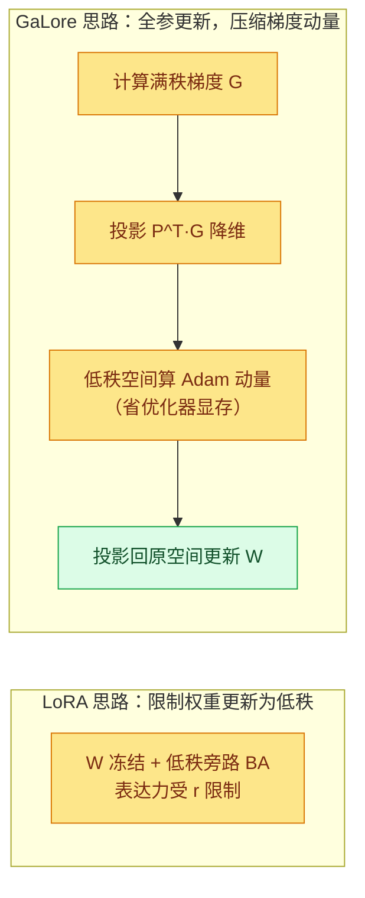
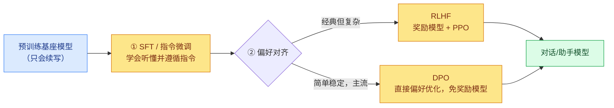
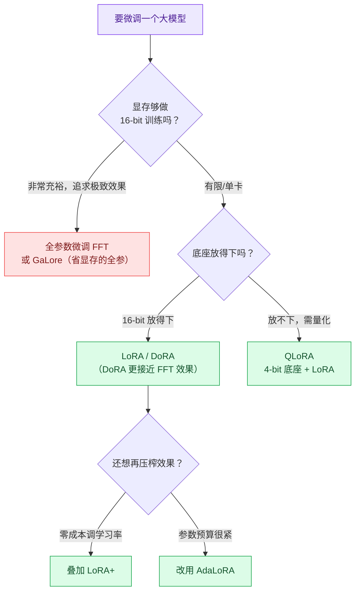

---
{"dg-publish":true,"permalink":"/02.资料分类/AI研究/Finetuning/大模型微调技术综述：从全量微调到PEFT与LoRA家族（2022-2025）/","title":"大模型微调技术综述：从全量微调到 PEFT 与 LoRA 家族（2022–2025）","tags":["综述","AI-Research","微调","PEFT","LoRA","QLoRA","AdaLoRA","DoRA","GaLore","指令微调","对齐"],"dg-note-properties":{"type":"综述","domain":"AI研究","subfield":"Finetuning","title":"大模型微调技术综述：从全量微调到 PEFT 与 LoRA 家族（2022–2025）","tags":["综述","AI-Research","微调","PEFT","LoRA","QLoRA","AdaLoRA","DoRA","GaLore","指令微调","对齐"],"status":"已整理","created":"2026-06-30","related":["[[02.资料分类/AI研究/Finetuning/LoRA论文解读报告\|LoRA论文解读报告]]","[[02.资料分类/AI研究/Finetuning/大模型微调笔记：对比LoRA、QLoRA、AdaLoRA、LoRA+\|大模型微调笔记：对比LoRA、QLoRA、AdaLoRA、LoRA+]]","[[02.资料分类/AI工程/开源大模型训练、微调与部署框架深度研究报告：核心技术、优缺分析及国产芯片适配选型\|开源大模型训练、微调与部署框架深度研究报告：核心技术、优缺分析及国产芯片适配选型]]"]}}
---

# 大模型微调技术综述：从全量微调到 PEFT 与 LoRA 家族（2022–2025）

> 本文系统梳理 2022 年以来主流的大模型微调技术，覆盖**全参数微调**、**参数高效微调（PEFT）四大流派**、**LoRA 家族的工程化演进**，以及**指令微调与对齐**。目标是图文并茂、脉络清晰，既讲清"是什么、为什么、怎么做"，也给出**实战选型建议**。
>
> 配套精读：[[02.资料分类/AI研究/Finetuning/LoRA论文解读报告\|LoRA论文解读报告]]（原始论文细节）、[[02.资料分类/AI研究/Finetuning/大模型微调笔记：对比LoRA、QLoRA、AdaLoRA、LoRA+\|大模型微调笔记：对比LoRA、QLoRA、AdaLoRA、LoRA+]]（变体速查）。

***

## 一、为什么需要"高效微调"

大模型时代的主流范式是 **"大规模预训练 + 下游任务适配"**。最直接的适配方式是 **全参数微调（Full Fine-Tuning, FFT）**：用预训练权重初始化，再对**所有参数**做梯度更新。它效果好、上限高，但代价随模型规模爆炸式增长：

- **显存墙**：训练时不仅要存权重，还要存梯度 + 优化器状态（Adam 需要一阶、二阶动量）。粗略地说，FFT 显存约为推理的 **3–4 倍**。微调一个 7B 模型动辄需要 60GB+ 显存。
- **存储墙**：每个下游任务都要保存一份完整模型副本。175B 模型每个任务一份，部署成本几乎不可行。
- **切换成本**：多任务服务时，加载/切换整模型代价高昂。

**参数高效微调（Parameter-Efficient Fine-Tuning, PEFT）** 应运而生：**冻结绝大部分预训练参数，只训练极少量新增/选中的参数**，在逼近 FFT 效果的同时，把显存、存储、切换成本压低一两个数量级。

*PEFT 四大流派概览。本文重点是第④类"重参数化"中的 LoRA 家族——它兼顾了"零推理延迟"与"高质量"，成为当前事实标准。*

***

## 二、技术全景时间线（2019 → 2025）

> 一句话脉络：**Adapter/软提示打开了 PEFT 的大门 → LoRA 用"低秩旁路+零延迟"成为主流 → QLoRA 把门槛降到消费级显卡 → AdaLoRA/LoRA+/DoRA 等在"秩分配、学习率、表达力"上精雕细琢 → GaLore 另辟蹊径让全参微调也能省显存**。

***

## 三、PEFT 的两类"前传"：Adapter 与软提示

LoRA 之所以能后来居上，是因为它解决了前两类方法的关键痛点。理解它们有助于理解 LoRA 的设计取舍。

### 3.1 Adapter（加法式，2019）

在 Transformer 每个子层后**插入一个小型瓶颈结构**（降维 → 非线性 → 升维），只训练这些插入层。

- **优点**：参数少、效果稳。
- **致命短板**：插入层是**串行计算**，无法被硬件并行掩盖，**引入推理延迟**——在 batch=1 的在线短序列场景尤其明显（LoRA 论文 Tab.1 实测延迟增加 20%–30%）。

### 3.2 软提示类：Prefix / Prompt / P-Tuning（2021）

不改模型权重，而是在输入端**拼接一段可训练的"软提示"向量**，让模型学会"被引导"。

- **优点**：参数极少，不动模型主体。
- **短板**：**难优化**（性能随参数非单调变化）；**挤占上下文长度**；表达力受限（无法逼近全量微调）。

> LoRA 的破局点：把可训练参数做成**与主干并联的线性旁路**，部署时可**合并进权重**——既不串行（无延迟），也不占序列（不挤上下文），还能通过增大秩逼近全量微调。

***

## 四、LoRA：低秩适配（基石）

> 详细推导与实验见 [[02.资料分类/AI研究/Finetuning/LoRA论文解读报告\|LoRA论文解读报告]]，此处只给综述所需的核心直觉。

**核心假设**：模型适配下游任务时，权重的**变化量 $\Delta W$ 具有很低的"内在秩"**。既然如此，就不必更新整块 $W_0$，只需学习一个低秩分解：

$$W_0 + \Delta W = W_0 + BA,\qquad B\in\mathbb{R}^{d\times r},\ A\in\mathbb{R}^{r\times k},\ r\ll\min(d,k)$$

训练时冻结 $W_0$，只训练 $A、B$。前向传播为 $h = W_0x + \frac{\alpha}{r}BAx$，初始化时 $B=0$、$A\sim\mathcal{N}(0,\sigma^2)$，使起点 $\Delta W=0$ 不扰动原模型。

**四大优势**：① 可训练参数最低降至 **0.01%**，checkpoint 缩小约 **10,000×**；② 省去冻结参数的优化器状态，**显存降约 3×**；③ 线性结构使 $W=W_0+BA$ 可在部署时**合并，推理零额外延迟**；④ 一个底座挂多个小模块，**任务热插拔**。

**已知短板**（正是后续变体的改进点）：
- 秩 $r$ **固定且需人工指定**，不同层/不同任务的"信息量"其实不同 → **AdaLoRA**。
- 底座仍是 16-bit，微调大模型显存门槛依然高 → **QLoRA**。
- $A、B$ 用同一学习率，理论上次优 → **LoRA+**。
- 只调"更新量"，与全量微调在"幅度/方向"的学习模式上有差距 → **DoRA**。

***

## 五、LoRA 家族横向对比（核心）

下面四个变体是 2023–2024 年最主流的 LoRA 改进方向，分别从**量化、秩分配、优化、表达力**四个维度发力。

### 5.1 QLoRA：把门槛降到消费级显卡（NeurIPS 2023）

QLoRA 的洞见：**LoRA 已经让"可训练参数"很小，但显存大头其实是"冻结的底座本身"**。于是把底座**量化到 4-bit**，再在其上做 LoRA。三个关键创新：

- **NF4（4-bit NormalFloat）**：针对神经网络权重近似正态分布而设计的信息论最优 4-bit 数据类型。
- **双量化（Double Quantization）**：把量化常数本身再量化一次，进一步省显存。
- **分页优化器（Paged Optimizers）**：用 NVIDIA 统一内存机制，在显存峰值时把优化器状态临时换出到内存，避免 OOM。

效果：**在单张 48GB GPU 上微调 65B 模型**，且基本保持 16-bit 全量微调的效果。代价是底座量化带来的轻微精度损失，以及反量化的计算开销（训练略慢）。

### 5.2 AdaLoRA：让秩"自适应"分配（ICLR 2023）

普通 LoRA 给所有层分配**相同的固定秩**，但实际上不同权重矩阵对任务的重要性差别很大——把有限的参数预算平均撒出去并不划算。

AdaLoRA 的做法：把增量参数化为 **SVD 形式 $\Delta W = P\Lambda Q$**（$P、Q$ 近似正交，$\Lambda$ 是奇异值对角阵），训练中根据**重要性分数**动态地把不重要的奇异值（及对应方向）**剪枝置零**，从而把参数预算自动倾斜给更关键的层。

- **优点**：同等参数预算下效果更好；自动找到"该在哪用大秩"。
- **代价**：训练逻辑更复杂，需维护重要性评估与正则项，调试成本上升。

### 5.3 LoRA+：一个被忽视的学习率细节（ICML 2024）

LoRA 默认给 $A$ 和 $B$ **同一个学习率**。LoRA+ 从理论分析指出：在大模型宽度下这是**次优**的，应该让 **$B$ 的学习率显著大于 $A$**（典型比值 $\lambda = \eta_B/\eta_A$ 取 4~16）。

- **几乎零成本**：不改结构、不加参数，只调优化器里两组参数的学习率比例。
- **收益**：收敛更快、最终效果更好，尤其在较难任务上。

### 5.4 DoRA：幅度与方向解耦（ICML 2024 Oral，NVIDIA）

DoRA 先做了一个分析：**全量微调**在更新时，权重的**幅度（magnitude）**和**方向（direction）**呈现出与 LoRA 不同的相关模式——这是 LoRA 效果略逊于 FFT 的一个原因。

DoRA 的方案：把预训练权重分解为 **幅度向量 $m$ + 方向矩阵 $V$** 两部分：

$$W = m\cdot\frac{V}{\lVert V\rVert},\quad \text{其中方向更新用 LoRA：} V' = V + BA$$

即**幅度单独训练，方向交给 LoRA**。这样 DoRA 的学习行为更接近全量微调，在多个任务上**以相同参数量超越 LoRA**，且推理时同样可合并（零额外延迟）。

### 5.5 速查表

| 维度 | **LoRA** | **QLoRA** | **AdaLoRA** | **LoRA+** | **DoRA** |
| --- | --- | --- | --- | --- | --- |
| **核心思想** | 低秩旁路 $BA$ | 4-bit 底座 + LoRA | 秩自适应分配 | $A/B$ 不同学习率 | 幅度/方向解耦 |
| **主攻痛点** | 参数/显存效率 | 显存门槛 | 秩固定不灵活 | 收敛与精度 | 逼近全量微调表达力 |
| **关键技术** | $\Delta W=BA$ | NF4+双量化+分页 | SVD+重要性剪枝 | $\eta_B\gg\eta_A$ | $W=m\cdot V/\lVert V\rVert$ |
| **额外开销** | 低 | 反量化算力↑ | 训练逻辑复杂 | 几乎为零 | 略高于 LoRA |
| **推理延迟** | 可合并，零延迟 | 可合并 | 可合并 | 可合并 | 可合并 |
| **典型场景** | 通用首选 | 单卡微调大模型 | 预算紧、追极致 | 想白嫖一点提升 | 追平 FFT 效果 |

***

## 六、另一条路线：GaLore——让"全参数微调"也省显存（ICML 2024 Oral）

LoRA 家族的本质是**减少可训练参数**。GaLore 反其道而行：**仍然全参数训练，但把"梯度"投影到低秩子空间**，从而压缩占显存大头的**优化器状态**。

直觉：训练过程中权重的**梯度**也近似低秩。GaLore 用 SVD 找到梯度的低秩投影矩阵 $P$，把梯度投影到低维（$G_{low}=P^\top G$）后再算 Adam 动量，最后投影回原空间更新权重。优化器状态从"全尺寸"降为"低秩尺寸"。

- **关键区别**：LoRA 改变的是"能学什么（受限于低秩 $\Delta W$）"；GaLore 不限制权重的表达力，**权重仍可满秩更新**，只压缩动量存储。
- **战绩**：首次在**单张 24GB 消费级显卡（RTX 4090）上从零预训练 7B 模型**。

> 一句话区分：**LoRA = 少训点参数；GaLore = 照常训全部参数，但优化器状态低秩存储**。两者目标都是省显存，路径不同，也可结合使用。

***

## 七、容易混淆的另一维度：微调的"目标"——指令微调与对齐

前面讲的都是"**怎么省**"（PEFT/量化等，属于**方法/效率**维度）。还有一个正交的"**学什么**"维度——即微调的**目标/数据形态**，这是大模型能"听话"的关键：

- **SFT（监督微调 / 指令微调，Instruction Tuning）**：用大量 `(指令, 理想回答)` 配对数据训练，让模型学会**遵循指令**。InstructGPT（2022）是里程碑。SFT 既可以全参数做，也可以用 LoRA/QLoRA 做。
- **RLHF（人类反馈强化学习）**：在 SFT 之后，训练奖励模型并用 PPO 等强化学习算法进一步对齐人类偏好。效果强但流程复杂、不稳定。
- **DPO（直接偏好优化，2023）**：**绕过显式奖励模型**，直接用偏好数据对（chosen vs. rejected）做一个分类式损失来对齐。比 RLHF 更简单、更稳定，已成为开源社区主流对齐手段。

> **两个维度是正交的**：你可以"用 QLoRA 做 SFT"，也可以"用 LoRA 做 DPO"。**PEFT 解决"怎么训得省"，指令微调/对齐解决"训成什么样"**。

***

## 八、实战选型指南

### 8.1 决策流程图

### 8.2 一句话建议

- **资源充足、要最高上限**：全参数微调；显存吃紧又想全参，用 **GaLore**。
- **通用默认首选**：**LoRA**——成熟、生态好、零推理延迟。
- **单卡微调大模型（7B~70B）**：**QLoRA**，把底座压到 4-bit。
- **想免费再提一点效果**：叠加 **LoRA+**（只改学习率比），或换 **DoRA**（更贴近 FFT）。
- **参数预算极紧、追极致**：**AdaLoRA**，把秩用在刀刃上。
- **要让模型"听话"**：先 **SFT/指令微调**，再用 **DPO** 做偏好对齐（比 RLHF 简单稳定）。

### 8.3 通用调参经验

- **作用矩阵**：优先适配注意力的 $W_q,W_v$；预算足可扩到 $W_q,W_k,W_v,W_o$ 乃至 MLP。
- **秩 $r$**：从 8 或 16 起步；任务越复杂/数据越多可适当加大，但收益常很快饱和（LoRA 论文显示 $r=1\sim8$ 已极具竞争力）。
- **$\alpha$**：常设为 $r$ 的 1~2 倍（如 $r=8,\alpha=16$）。
- **学习率**：PEFT 通常比全量微调高一个量级（如 1e-4 ~ 3e-4）。
- **工程落地**：HuggingFace **PEFT** 库、**LLaMA-Factory**、**Unsloth** 均已原生支持上述方法，详见 [[02.资料分类/AI工程/开源大模型训练、微调与部署框架深度研究报告：核心技术、优缺分析及国产芯片适配选型\|开源大模型训练、微调与部署框架深度研究报告：核心技术、优缺分析及国产芯片适配选型]]。

***

## 九、总结

2022 年以来，大模型微调的主线是 **"在逼近全量微调效果的前提下，不断降低显存/存储/切换成本"**：

1. **Adapter/软提示**打开了 PEFT 大门，但分别受困于推理延迟与优化难度；
2. **LoRA** 用"低秩旁路 + 可合并 + 零延迟"成为基石；
3. **QLoRA** 把底座量化到 4-bit，让单卡微调大模型成为现实；
4. **AdaLoRA / LoRA+ / DoRA** 分别在**秩分配、学习率、表达力**上精细打磨；
5. **GaLore** 另辟蹊径，让全参数训练也能省显存；
6. 与此正交的是 **SFT 指令微调 + DPO/RLHF 对齐**，决定模型"学成什么样"。

如今 LoRA 家族已是开源微调的事实标准。选型的关键不在于"哪个最先进"，而在于**匹配你的显存预算、效果要求与任务复杂度**——多数场景下 **LoRA / QLoRA 仍是最稳妥的起点**。

***

## 🔗 相关笔记

- [[02.资料分类/AI研究/Finetuning/LoRA论文解读报告\|LoRA论文解读报告]] — LoRA 原始论文的原理、实验与低秩性分析
- [[02.资料分类/AI研究/Finetuning/大模型微调笔记：对比LoRA、QLoRA、AdaLoRA、LoRA+\|大模型微调笔记：对比LoRA、QLoRA、AdaLoRA、LoRA+]] — 四个变体的速查对比
- [[02.资料分类/AI工程/开源大模型训练、微调与部署框架深度研究报告：核心技术、优缺分析及国产芯片适配选型\|开源大模型训练、微调与部署框架深度研究报告：核心技术、优缺分析及国产芯片适配选型]] — 这些方法在主流框架中的工程落地
- [[知识图谱与索引\|知识图谱与索引]] — 返回全局知识地图

> 主要参考文献：LoRA（[arXiv:2106.09685](https://arxiv.org/abs/2106.09685)）、QLoRA（[arXiv:2305.14314](https://arxiv.org/abs/2305.14314)）、AdaLoRA（arXiv:2303.10512）、LoRA+（arXiv:2402.12354）、DoRA（[arXiv:2402.09353](https://arxiv.org/abs/2402.09353)，ICML 2024 Oral）、GaLore（[arXiv:2403.03507](https://arxiv.org/abs/2403.03507)）、InstructGPT（arXiv:2203.02155）、DPO（arXiv:2305.18290）。
