---
{"dg-publish":true,"permalink":"/02.资料分类/BP/Industry-Research/煤矿井下机器人行业调研报告/","title":"煤矿井下机器人行业调研报告","tags":["行业调研","煤矿机器人","矿山自动化","特种机器人","具身智能","智能矿山","商业模式"],"dg-note-properties":{"type":"行业调研","domain":"商业计划","subfield":"Industry-Research","title":"煤矿井下机器人行业调研报告","tags":["行业调研","煤矿机器人","矿山自动化","特种机器人","具身智能","智能矿山","商业模式"],"status":"已完成","created":"2026-06-22","related":["[[02.资料分类/AI研究/Robotics/π0.7解读报告.md]]","[[02.资料分类/智能体/README.md]]","[[知识图谱与索引\|知识图谱与索引]]"]}}
---

# 煤矿井下机器人行业深度调研报告

> 调研时间：2026 年 6 月 ｜ 范围：国内外煤矿/地下采矿机器人的公司、产品形态、商业模式、政策与市场
> 数据说明：本报告数据来自政府公开文件、上市公司财报、国际行业研究机构与权威媒体。文中明确区分**确切数据**与**第三方估算/预测**，以及**已商用落地**与**研发/试点阶段**。

---

## 一、执行摘要（TL;DR）

1. **市场本质**：煤矿井下机器人是"政策强驱动 + 安全刚需 + 招工难"三重逻辑下的特种机器人细分赛道，核心价值主张是**"减人、增安、提效"**（井下少人化/无人化）。

2. **中外路线分化**：
   - **中国**：以**井工煤矿**为主，特色是"智能化综采工作面 + 巡检/钻锚/救援等专用机器人"，强政策驱动、强防爆约束，商业模式以**整机销售 + 系统集成总包**为主。
   - **国外**：以**露天矿自动驾驶卡车（AHS）+ 硬岩地下金属矿 LHD 自动化**为主，商业化更成熟；真正贴合**煤炭长壁开采**的国际厂商核心是 **Komatsu（Joy）**。

3. **落地成熟度排序**：智能化综采（最成熟）> 巡检机器人（规模落地）> 掘进/钻锚机器人（试点转商用）> 喷浆/运输机器人（局部）> 井下搜救机器人（多为应急配置与试验）。

4. **市场规模量级**：全球狭义"矿山机器人"约 **15 亿美元**（2025），CAGR 约 10–14.5%，井下增速最快；中国矿用机器人专项约 **24 亿元（2024）→ 64 亿元（2030E）**，CAGR >18%；广义智慧矿山市场 2025 年约 **670 亿元**，远期智能煤矿市场空间或达 **1.4 万亿元**。中国是亚太最大单一市场。

5. **关键门槛**：**防爆认证**（国内 MA 标志/隔爆本安、海外 ATEX/IECEx）是煤矿（瓦斯环境）落地的最大卡口，也是国际通用巡检机器人（Spot、ANYmal）少见专门煤矿案例的根本原因。

6. **前沿趋势**：AI 大模型入矿（行业专用大模型）、具身智能/防爆人形机器人探索、5G 专网 + 数字孪生、无人化工作面。

7. **最新政策信号**：2026 年 5 月，工信部与国家矿山安全监察局发布《矿山机器人应用验证试点通知》（矿安综〔2026〕7 号），依托国务院"场景培育"战略，场景由煤矿"5 大类"扩至全矿种"7 类"（新增选矿、辅助作业），政策抓手从"研发目录"升级为"应用验证闭环试点"，并配以首台套认定、中央预算内投资、产能核增等实质激励——行业进入规模化场景验证新阶段。

---

## 二、行业背景与驱动因素

### 2.1 三大驱动力

| 驱动力         | 内涵                      | 实证                                                       |
| ----------- | ----------------------- | -------------------------------------------------------- |
| **政策强驱动**   | 国家明确"井下少人/无人化"导向，有明确时间表 | 煤矿智能化 2025/2035 时间表；"AI+"能源 2027/2030 目标                 |
| **安全压力**    | 瓦斯、透水、顶板事故高发，机器人替代高危岗位  | 2021–24 较 2016–20，煤矿事故年均起数 **-29.7%**、死亡 **-29.1%**      |
| **招工难/老龄化** | 井下环境恶劣，年轻劳动力不愿入井        | 山西马兰矿智能化工作面用工 **-40%**、单班产量 **+60%**；宁煤洗煤厂单班由 30 人减至 7 人 |

**部署实况（截至 2024 年 9 月）**：全国已有 **30 余类、2,640 台（套）机器人 + 1,328 台无人驾驶车辆**在煤矿推广应用，**1.7 万个固定岗位**实现无人值守。典型减人效应：智能化掘进工作面作业人员 **18→8 人**，巡检机器人将人工巡检 **8→2 人**。

**经济效益（典型测算）**：
- 智能掘进机器人：应用后平均月掘进 **1,050 米**，新增产值 **9,436.7 万元**、新增利润 **4,897.6 万元**（陕西小保当案例）。
- 巡检机器人：年节省人工成本约 **40 万元**，投资回收期短，ROI 明确。

### 2.2 技术与准入痛点

- **防爆认证门槛**：井下瓦斯环境要求本质安全/隔爆设计。国内需**煤矿安全标志（MA 标志）**及防爆认证，海外对应 **ATEX（欧盟）/IECEx**。大幅抬高研发成本与迭代周期。
- **井下复杂环境**：瓦斯、高浓度粉尘、潮湿淋水、高低温交替、**无 GPS 定位**、窄巷道/受限空间、电磁屏蔽——对感知、定位导航、续航、通信构成综合挑战。这是井下机器人难于露天矿/通用机器人的根本原因。
- **续航与通信**：依赖 5G 专网 / UWB 等井下定位与无线网络支撑。

**图 1：行业驱动逻辑与价值闭环**

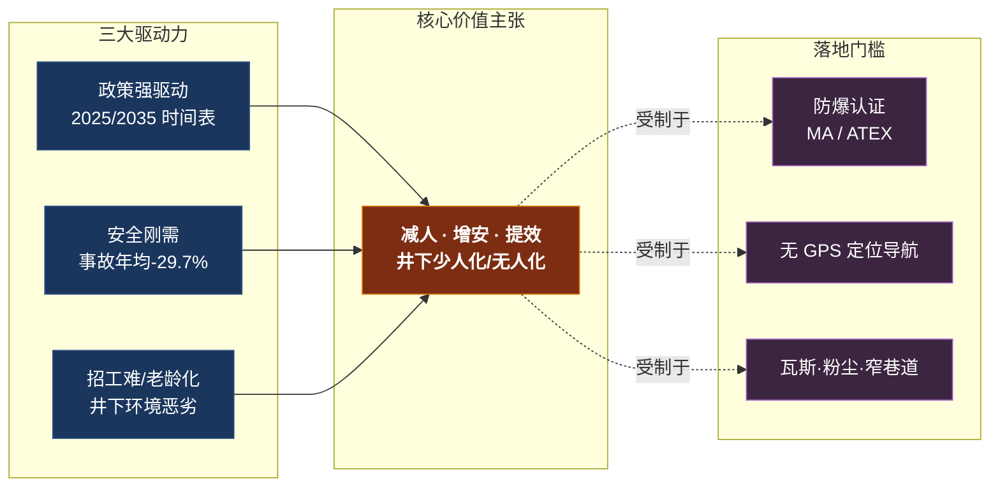

---

## 三、政策环境（中国）

### 3.1 奠基性政策：《煤矿机器人重点研发目录》（2019）

- **发布主体**：国家煤矿安全监察局（机构改革后归属应急管理部体系），2019 年 1 月发布。
- **核心内容**：明确重点研发 **5 大类、38 种**煤矿机器人。五大类为：

| 类别 | 定位 | 典型机型 |
|------|------|---------|
| **掘进类** | 巷道掘进、钻锚支护 | 掘进机器人、钻锚机器人、临时支护机器人 |
| **采煤类** | 采煤工作面作业 | 采煤机记忆截割、液压支架自动跟机 |
| **运输类** | 物料/人员运输 | 无人驾驶辅运、井下机车、带式输送机巡检 |
| **安控类** | 安全监测与巡检 | 巡检机器人、瓦斯巡检、密闭区探测 |
| **救援类** | 灾后搜救 | 防爆救援机器人、侦测机器人 |

**图 2：煤矿机器人五大类（2019 重点研发目录）**

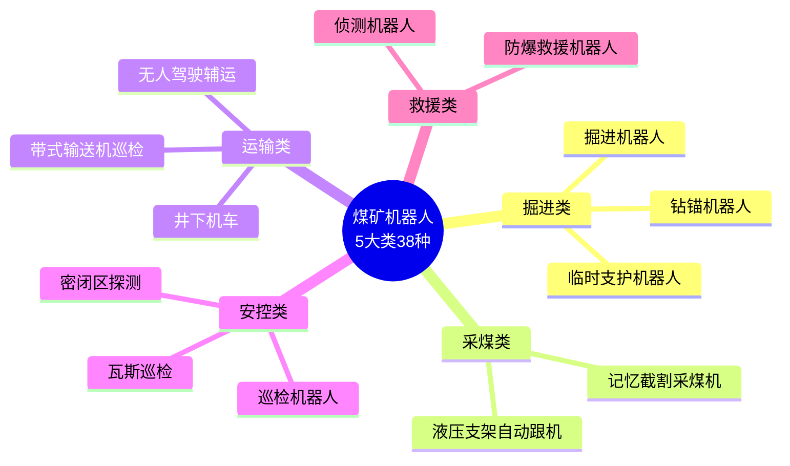

### 3.2 智能化建设主干政策

- **《关于加快煤矿智能化发展的指导意见》（2020）**：八部委联合印发，首次系统提出时间表——2021 建成示范、**2025 大型煤矿基本实现智能化**、**2035 各类煤矿基本实现智能化**。纲领性文件。
- **《煤矿智能化建设指南（2021 年版）》**：国家能源局、国家矿山安全监察局印发，细化建设标准与技术路径。
- **《关于深入推进矿山智能化建设促进矿山安全发展的指导意见》（2024.04）**：提出**量化目标——到 2026 年全国煤矿智能化产能占比不低于 60%、井下人员减少 10% 以上**，大幅加速行业渗透。
- **矿山智能化建设激励政策（2024.12）**：明确"真金白银"激励——智能化煤矿**产能核增幅度可上浮 2 级级差**；智能化设备改造投入可按 **10% 比例抵免企业所得税**；煤矿安全改造中央预算内投资**单个项目最高补助 3,000 万元**；安全生产费用可用于智能化建设与机器人推广。
- **《进一步加快煤矿智能化建设通知》（2025.05）**：聚焦关键环节机器人应用，突破关键技术，精准施策。
- **地方配套**：山西、内蒙古等资源大省对机器人采购给予 **15%–20% 财政补贴**，形成"中央统筹—部委细化—地方落实"的三级推进与政策-市场双重驱动。
- **"十四五"规划**：煤矿智能化纳入现代能源体系、安全生产等规划，2021–2025 为关键建设期。

### 3.3 2025 最新动向："AI+"能源

- **《关于推动"人工智能+"能源高质量发展的实施意见》**（发改〔2025〕73 号，2025-09-08）：
  - **量化目标**：到 **2027 年**在电网、发电、煤炭、油气等领域部署 **5 个以上**行业专用大模型、**10 个以上**示范项目、探索 **100 个**应用场景；到 **2030 年**能源领域 AI 应用达世界领先。
  - 涉煤表述：明确提出用 AI"替代煤矿中危险或劳动密集型任务"。
- **上位文件**：《国务院关于深入实施"人工智能+"行动的意见》（2025），鼓励具身智能/机器人研发。

**图 3：中国煤矿智能化政策时间轴**

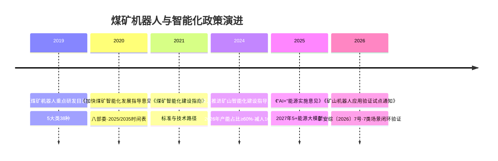

### 3.4 部署进展（官方口径）

| 时间 | 智能化采掘工作面 | 机器人应用 |
|------|----------------|-----------|
| 2020（"十三五"末） | 494 个 | — |
| 2022.3 | 813 个 | 29 种机器人在 370+ 煤矿应用 |
| 2025.9 | **1,930 个** | 持续增长 |

> 数据来源：国务院/应急管理部、国新办发布会。仍处快速建设期。

**图 4：智能化采掘工作面数量增长（个）**

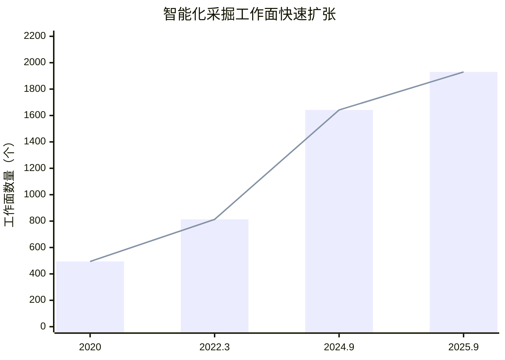

> 5 年增长近 4 倍（494 → 1,930），CAGR 约 31%，印证赛道高景气。截至 2024.9 已建成 1,642 个工作面、859 处煤矿有智能化工作面，智能化投资总规模近 2,000 亿元。

### 3.5 2026 最新动向：矿山机器人应用验证试点

- **政策本体**：《国家矿山安全监察局综合司、工业和信息化部办公厅关于开展矿山机器人应用验证试点工作的通知》，文号 **矿安综〔2026〕7 号**，**成文日期 2026 年 5 月 20 日**，官网公开发布 5 月 22 日。
- **制定依据**：深入贯彻《国务院办公厅关于加快场景培育和开放、推动新场景大规模应用的实施意见》——本质是国家"场景培育"战略在矿山领域的落地，核心目标为"加快推动矿山机器人研发和规模化应用，推动**险累苦脏岗位**机器人替代，提升矿山本质安全水平"。
- **时间巧合提示**：通知成文于 5 月 20 日，**早于**山西沁源留神峪煤矿"5·22"瓦斯爆炸事故（5 月 22 日晚，造成约 82 死、128 伤、2 失踪）。两者同在 22 日见诸公众视野属时间巧合，**政策并非该起事故的应急产物**，但事故进一步凸显了"机器换人、提升本质安全"的紧迫性，与本政策方向一致。

**聚焦七类应用场景**（验证重点：安全性、可靠性、稳定性、实用性、复杂环境适应性、协同作业能力）：

| 场景 | 对应 2019 目录 | 备注 |
|------|---------------|------|
| 矿山掘进 | 掘进类 | — |
| 采矿 | 采煤类 | 由"采煤"扩展为更广义"采矿"（含金属/非金属矿） |
| 运输 | 运输类 | — |
| **选矿** | （新增） | 由井下延伸至**地面选矿**环节 |
| **辅助作业** | （新增） | 单列辅助作业类 |
| 安控 | 安控类 | — |
| 应急救援 | 救援类 | — |

**验证周期要求**（按场景差异化设定）：

| 场景类别 | 验证地点数 | 单地点验证周期 |
|----------|-----------|---------------|
| 掘进类、采矿类、选矿类 | 不限（≥1） | 不少于 **6 个月** |
| 运输类、安控类 | 不少于 **2 个** | 每地点不少于 **6 个月** |
| 辅助作业类、应急救援类 | 不少于 **3 个** | 每地点不少于 **9 个月** |

**申报与组织实施关键节点**：
- **申报形式**：以**联合体**自愿申报，须含矿山企业、机器人研发/生产企业、高校/科研院所（零部件企业、检测检验机构可参与），并明确 **1 家矿山企业为牵头单位**。
- **硬性门槛**：每个联合体须开展**不少于 2 种、10 台（套）**机器人应用验证；机器人产品须取得**"矿用产品安全标志证书"**或"矿用产品工业性试验安全标志证书"等资质（即 **MA 标志**仍是硬门槛）。
- **推荐与遴选**：省级局会同应急、工信部门组织申报推荐；中央企业由集团统一推荐。材料于 **2026 年 7 月 20 日前**报送国家矿山安全监察局安全基础司。由安全基础司与工信部装备工业一司联合组建专家组遴选、公示后发布。
- **执行周期**：入围后 **1 个月内启动**、**2 年内完成**全部验证，每半年报告进展。
- **政策支持**：在**首台（套）装备认定、中央预算内投资、煤矿产能核增**等方面统筹支持；设**退出机制**（安全管理不到位、未按计划推进或弄虚作假者终止资格）。

- **政策含义解读**：
  1. **从"煤矿"扩展到"矿山"**：场景由 2019 年聚焦煤矿的"5 大类"，升级为覆盖全矿种（金属、非金属、露天等）的"7 类"，**新增"选矿""辅助作业"**，把地面选矿环节也纳入验证范围。
  2. **从"研发目录"升级到"应用验证试点"**：政策抓手由早期"重点研发"（鼓励造出来）转向"应用验证—效果反馈—改进完善—再应用验证"的**闭环机制**，标志行业从研发走向**规模化场景验证与商用推广**新阶段。
  3. **"产学研用检"联合体 + 真金白银激励**：强制联合体绑定矿企、厂商、科研、检测多方，配以首台套认定、中央预算内投资、产能核增等实质激励，意在打通"技术成熟—可靠适用—可复制推广"的产业化链条，并同步推动**标准规范**（零部件—整机—系统全链条）建设。

> 数据来源：政策内容据原文《矿安综〔2026〕7 号》（chinamine-safety.gov.cn，t20260522_604631）；留神峪"5·22"事故伤亡数据据财经媒体（AAStocks 援引中银国际/摩根士丹利报告）。事故为山西省最终核定口径，以官方调查报告为准。

---

## 四、国内主要企业与产品

**图 5：国内煤矿机器人产业图谱（三大阵营 × 价值链定位）**

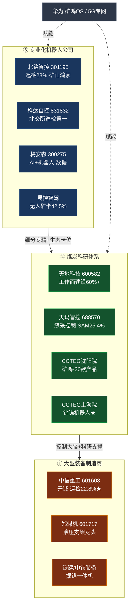

### 4.1 智能化综采"控制大脑"

**天玛智控（北京天玛智控科技，科创板 688570）**
- **出身**：脱胎于中煤科工体系的"天地玛珂（Tiandi Marco）"，2023 年由**天地科技（600582）**分拆上市，是智能综采控制系统的**绝对龙头**与"国产替代"核心。
- **主业**：液压支架电液控制系统（SAC）、采煤机自动化控制系统（SAM）、智能集成供液系统（SAP）——国内综采工作面智能化"控制大脑"。
- **市占率**：2025 上半年 **SAM 系统市占率 25.4%、SAP 系统 16%**；自研 **LongWallMind 6.0** 系统实现国产替代，破解煤矿无人化开采"卡脖子"难题，支持多终端访问与 50+ 工业协议，已在国家能源集团、陕煤集团等规模化应用。
- **财务（人民币）**：营收 2021 ≈ 15.4 亿 → 2022 ≈ 19.6 亿 → 2023 ≈ 21.9 亿 → 2024 ≈ 18.5 亿（-15.7%）→ 2025 ≈ 16.2 亿（-13%）；2025 净利约 0.98 亿（同比 -71%）；市值约 83 亿。
- **判读**：2024–25 连续下滑，反映**煤炭行业资本开支放缓**对智能化设备需求的传导，是本赛道的周期性风险信号。

**图 6：天玛智控营收趋势（亿元）— 赛道周期性的缩影**

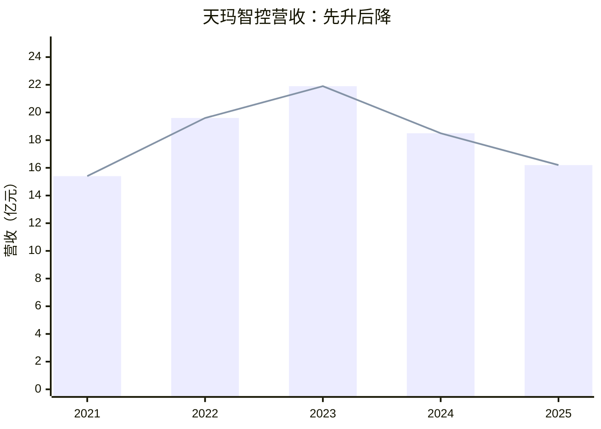

> 2023 见顶后连续两年下滑，与煤企 CapEx 周期高度同步，是评估本赛道投资节奏的重要警示。

### 4.2 特种机器人龙头

**中信重工（A 股 601608）/ 开诚智能**
- **背景**：旗下开诚智能位于河北唐山，是**煤矿机器人产品线最全**的企业之一，形成巡检、救援、防爆等 **20 余款**特种机器人；"智能防爆机器人"获国家级**制造业单项冠军**。
- **市场地位**：防爆巡检机器人市占率约 **22.8%，行业第一**；产品覆盖轨道/履带/轮式/四足全形态，客户覆盖国家能源、陕煤、中煤等 **23 个产煤省**。
- **财务**：2024 年营收 **80.3 亿元**，海外订单占比约 **33%**（国际化领先）。
- **产品线（已商用）**：
  - 防爆消防灭火/侦察机器人（一款喷水流量达 **200 升/秒**，号称国内最高，用于石化/油罐区）
  - 可燃气体探测机器人、人防应急巡检机器人、移动式重载智能高空作业机器人系统
  - 与**华为**联合开发"硬件+操作系统+AI"一体化解决方案，**防爆四足机器人进入工程验证阶段**
- **最新动向**：2025 年 7 月签约**徐矿集团 1.2 亿元**智能掘进机器人集群系统项目。
- **商业模式**：设备销售为主 + 智能化矿山/消防的系统集成总包。

### 4.3 国家队：中煤科工集团（CCTEG）

机器人产品分散在各研究院/子公司，是国内煤机与煤矿智能化的"国家队"。

- **集团级成果**：全球首套 **10 米超大采高智能综采**成套装备（两项世界纪录）；**透明地质**系统；无人智能采矿在国家能源集团、山东能源集团试点，**采煤效率 +20% 以上**；发布矿业首个原生通用大模型**"太阳石"**和地质垂直大模型 **GeoGPT**。战新产业收入已占集团 **55%**。
- **上海研究院 ★ 标志性产品**：**中国首台智能悬臂式钻锚机器人**
  - 落地：**山东能源集团东滩煤矿**，经 6 个月工业性试验后于 **2025 年 6 月**转入正常运行。
  - 指标：集截割、装运、行走、钻孔、锚固、支护于一体；24㎡断面自动循环仅 **6 分钟**；月进尺 **+20% 以上**；"激光+惯导"双模定位，定位精度 ≤5cm、控制精度 ≤10cm；实现掘进面全程无人化截割。
- **常州研究院**：煤矿监测监控、人员定位、井下通信与巡检机器人/电液控制核心单位。
- **太原研究院**：掘进机、防爆装备；研制掘进工作面远程控制"太空舱"（数字孪生远程可视化监控）。
- **沈阳研究院**：我国成立最早（**1953 年**）的煤矿安全专业研究机构，**科研实力最强、产品线规划最全**——已研发近 **30 款**煤矿机器人、提炼 60 余项共性关键技术，规划 60 余款产品，并携手华为推出**全球首批"矿鸿（MineHarmony）系统"煤矿机器人群**；辅助作业类（喷浆、钻锚、管路安装、水仓清理、选矸）产品布局最全，另有两级救援机器人系统、蛇形机器人、水陆两栖侦检机器人等。
- **重庆研究院**：KJXX5 挂轨式巡检机器人等。

### 4.4 综采/掘进装备厂商（机器人化方向）

**天地科技（A 股 600582）— 中国煤机行业龙头**
- 中国煤炭机械行业龙头，**2024 年营收约 305 亿元**，主导全国 **60% 以上**煤矿智能化工作面建设；从勘探、设计到装备制造、煤矿运营提供一体化解决方案。是天玛智控（688570）的控股母公司、中煤科工体系的核心上市平台。

**郑州煤矿机械集团（A 股 601717，A+H）— 液压支架龙头**
- **全球最大液压支架制造商**，年产约 **3 万架**；**2024 年营收约 370 亿元**，其中煤机业务收入超 **150 亿元**，研发投入占比超 **5%**。推出 ZQ4000/20/40 履带行走液压支架（额定工作阻力 4,000kN），构建煤矿机器人技术体系，探索全寿命周期专业化服务。
- 国际化：2016 年首次向美国出口液压支架（中国煤机首次进美），并销往俄、澳、印、土等；并购博世起动机与发电机业务向高端汽车零部件延伸。
- **市占率口径提示**：第三方行业报告称其液压支架市占率"**超 60%**"（2024 口径，或指国内/特定细分）；本报告早前引用的"约 25%"系 2010–2011 历史数据，两者差异源于年份与统计口径，**以最新企业披露为准**。

**中铁装备 / 铁建重工**：研发 EJM 全系列掘锚一体机、矿用智能化悬臂掘进机，在山东煤矿成功应用；长距离智能喷浆设备制备效率 **15m³/h**、最长泵送 1,000 米。
**石煤机（石家庄煤矿机械）**：掘进机、刮板输送机、辅助运输设备，布局智能掘进/无人辅运。
**三一重装（三一国际旗下）**：掘进机、掘锚一体机、采煤机、智能化综采/快速掘进系统，向无人化延伸。

### 4.5 软件与巡检

- **北京龙软科技（科创板 688078）**：基于 GIS 的煤炭行业软件（矿山一张图、透明地质、安全生产管理）。1H23 营收 1.39 亿（+20.8%），但近期受行业景气回落明显下滑。
- **精英数智**：煤矿安全大数据/AI 软件（瓦斯、隐患预警、安全监管）。
- **华洋通信（山西华洋）**：煤矿井下通信、监测监控与智能化。
- **新松（Siasun）**：**GCR20-1400-Ex 防爆 6 轴工业机器人**（20kg 负载、±0.05mm 精度），布局石化/煤矿防爆巡检。

### 4.6 专业化机器人公司（新锐阵营）

这一阵营以"专精细分 + 高毛利（普遍 >30%）+ 技术标准/生态卡位"为特征，是行业增长最快、估值想象空间最大的群体。

- **北路智控（创业板 301195）— 巡检细分全国第一**：煤矿智能巡检机器人市占率 **28%**，产品覆盖井下皮带机、变电所等 **9 大高危场景**，**主导制定 3 项国家标准**；2025 Q1 发布**全球首款"矿山鸿蒙 OS 机器人"**（算力 32 TOPS）；多模态传感融合系统甲烷识别精度 **0.1%**、故障误报率 <1.2%；2025 年启动"机器人即服务"（按巡检里程 **0.8 元/公里**计费）；2024 年出口首批 20 台（单价 85 万/台，高于国内均价 68 万）。
- **科达自控（北交所 831832）— 北交所巡检出货第一**：深耕矿山智能化 30 年，M-CPS 智慧矿山整体解决方案入选工信部典型应用场景；矿用轨道/皮带巡检机器人已批量销售，四足机器人 2025 年起落地；承担科技部"复杂地质条件煤矿辅助运输机器人"项目。
- **梅安森（创业板 300275）— AI+机器人 + 数据服务**：构建"AI+机器人"体系，支持 2000+ 设备并发接入；联合**宇树科技**推进矿山四足机器人测试；通过设备数据沉淀提供订阅式服务（产能预测、设备维护）。
- **易控智驾 — 露天无人矿卡龙头**：无人矿卡市占率 **42.5%**；已与印尼 Adaro 煤矿达成合作（出海）。与**北方股份**同为无人驾驶矿卡商业化领先者。
- **天地科技（600582）巡检**：巡检机器人市占约 **12.9%**，中煤系平台、井下绝对主力。

### 4.7 国内产品形态代表

| 产品形态 | 代表企业/产品 | 阶段 |
|----------|----------|------|
| **巡检机器人**（挂轨/轮式/履带/四足） | 中信重工(22.8%)、北路智控(28%)、天地科技(12.9%)、科达自控、新松；CCTEG 重庆院 KJXX5 挂轨式 | **规模商用**（最成熟，占比约 16%） |
| **智能综采系统**（采煤机+支架+刮板机） | 天玛智控（SAM 25.4%）、郑煤机 | **规模商用**（占比约 23%） |
| **智能掘进/钻锚系统** | CCTEG 上海院（东滩，已运行）、中铁装备 EJM、陕西小保当 EBH270D | **试点转商用**（占比约 19%） |
| **辅助作业机器人**（喷浆/钻锚/管路/水仓清理/选矸） | CCTEG 沈阳院（布局最全）、山东科技大学 CPF-55LK 喷浆、山东天河科技、中煤科工机器人公司 | 局部商用、**增长最快**（占比约 12%） |
| **无人驾驶/运输** | 易控智驾（42.5%）、北方股份 | 露天商用（占比约 15%） |
| **井下搜救机器人** | 中国矿大 CUMT-V 系列、唐山开诚 KQR48（均已取煤安认证）、CCTEG 沈阳院 | **研发→实战**（占比约 5%） |

**典型应用案例（增量）**：
- **智能掘进 · 陕西小保当矿业**：应用国内首套 **EBH270D 护盾式掘进机器人系统**，平均月掘进 **1,050 米**、日进尺突破 56 米，操作人员 **18→8 人**，新增产值 9,436.7 万元。
- **快速掘进 · 国能神东布尔台**："掘锚机+锚运破一体机+大跨距桥式装载机+机器人群"新模式，实现掘支平衡。
- **救援机器人首次实战 · 山西留神峪"5·22"事故**：2026 年 5 月留神峪瓦斯爆炸救援中，**救援侦测机器人首次参与实战救援**，配备气体传感器与实时摄像头，进入救援人员无法抵达的区域采集数据，标志救援机器人**从试验走向实战**。

### 4.8 竞争格局（三大阵营 + 三梯队）

国内呈"**大型装备制造商 + 煤炭科研体系 + 专业化机器人公司**"三足鼎立，按综合实力分三梯队：

| 梯队 | 代表企业 | 特征 |
|------|---------|------|
| **第一梯队（综合领导者）** | 中信重工、天地科技、郑煤机、铁建重工 | 业务市场+产品生态+智慧矿山方案齐备，营收强、研发投入大、有外销 |
| **第二梯队（专业佼佼者）** | 天玛智控、科达自控、北路智控、山河智能 | 细分领域（综采控制/巡检/智慧矿山方案）技术先发，**毛利率 >30%** |
| **第三梯队（专注产品型）** | 国兴智能、菲力克科技、戴德测控 | 专注机器人产品制造，资质/研发偏弱，性价比突出 |

- **市场集中度低**：行业 **CR10 约 20%**，多数企业仍专注大型开采/掘进设备，对智能化矿用机器人布局相对较少 → 呈"强者恒强、细分分化"格局，**存在并购整合空间**。
- **国际对照**：全球前 5（卡特彼勒、小松、山特维克、Epiroc、日立建机）合计占 **40%–50%**，集中度远高于中国——中国厂商在 5G+北斗融合定位、复杂地质适应性上领先，国际品牌在核心算法稳定性、多品牌设备兼容性上仍占优。

---

## 五、国外主要企业与产品

**图 7：国际厂商按应用场景定位（与煤炭的相关性）**

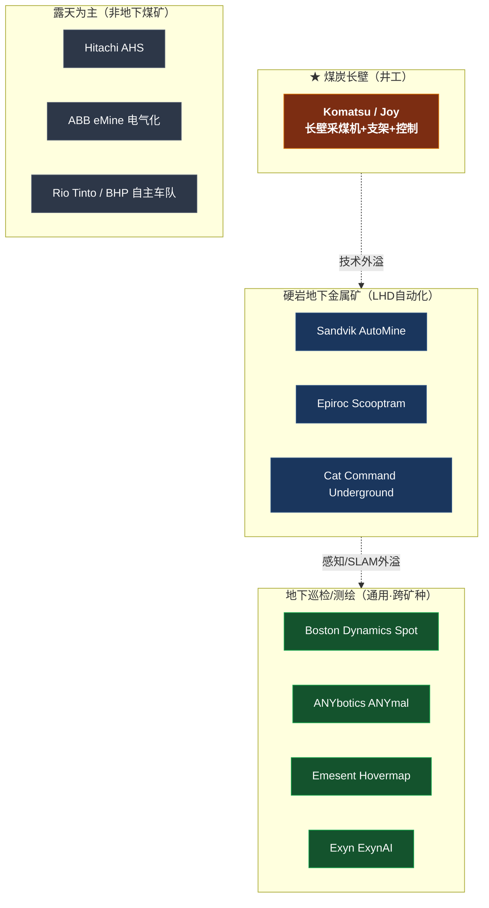

> 核心洞察：真正贴合**煤炭长壁**的国际厂商仅 Komatsu(Joy) 一家居核心；其余巨头主力在硬岩地下或露天，技术沿"长壁→硬岩→通用巡检"梯度外溢。

### 5.1 真正贴合煤炭：Komatsu（小松）— Joy 长壁自动化 ★

- **背景**：小松通过收购 **Joy Global**（Joy 品牌）成为**地下软岩/煤矿长壁开采自动化的全球主导厂商**，是国际企业中与**煤炭地下开采最直接相关**的。
- **核心产品**：
  - **Longwall Command and Control**：Web 化先进控制系统，将操作员撤出危险区、远程集中管理。
  - Joy 采煤机（Shearers）、Joy 液压支架（PRS）及 **RS20n/RS20s** 顶板支护电子控制。
  - Mining Intelligence + 3D Visualizer（实时可视化长壁设备）。
- **案例**：**CONSOL Energy + Komatsu** 凭长壁系统的**人员接近探测**获 **2018 NIOSH 矿山安全健康技术创新奖**。
- **相关性**：★ 直接核心——长壁开采即煤矿主流方法。

### 5.2 地下硬岩金属矿自动化（非煤长壁，但技术外溢相关）

| 公司 | 平台 | 核心能力 | 煤炭相关性 |
|------|------|---------|-----------|
| **Sandvik（山特维克）** | AutoMine® / OptiMine® | 地下 LHD 装运自动化部署最广；2026 推出 AutoMine® Aura（3D 感知） | 硬岩金属矿为主，**非煤长壁** |
| **Epiroc（爱普诺）** | 6th Sense / Mobilaris / Scooptram Autonomous | 自主铲运 + 遥操作 + 电池电动 LHD；2025 营收约 620 亿瑞典克朗 | 硬岩金属矿为主 |
| **Caterpillar** | Cat MineStar / Command for Underground | 地下 LHD 遥操作；露天 Command for Hauling 累计自主运输 **40 亿吨+** | 地下=硬岩；与煤多为露天推土机试验 |
| **ABB** | Ability™ eMine | 矿山电气化 + 提升机控制（不造整机） | 金属矿/电气化为主 |
| **Hitachi 建机** | AHS 自主运输 | 露天无人卡车 + 电气化 | **露天为主，非地下煤矿** |

> **关键判断**：Sandvik / Epiroc / Cat 的地下自动化主力场景是**硬岩金属矿（金/铜/锌/铂/铁）的 LHD 装运**；Cat / Hitachi / Rio Tinto / BHP 的大规模自主（10 亿吨级运输、自主铁路 AutoHaul®）几乎全在**露天**。

### 5.3 自主巡检机器人（四足/腿式）

- **Boston Dynamics — Spot**：地下/隧道巡检最广引用的腿式平台，配 **Orbit** 车队管理软件。案例：LKAB 基律纳铁矿（瑞典，巷道总长约 600km）、Glencore Kidd Creek 超深矿（加拿大）。**案例多为铁矿/硬岩/隧道，煤矿专门案例少**（防爆门槛）。
- **ANYbotics — ANYmal**（瑞士）：IP67 四足巡检机器人。截至 2025 年底工业部署约 **200 台**，累计融资 **1.5 亿美元**。案例：Vale 铁矿（巴西）、Anglo American 铂金矿。配 Data Navigator 走向 **Inspection-as-a-Service**。

### 5.4 自主无人机/激光雷达井下测绘

- **Emesent — Hovermap**（澳，CSIRO 衍生）：基于 SLAM 的 LiDAR 测绘载荷，支持**视距外自主飞行**，可在 2.4m 窄通道自主探采空区。案例：48 小时内测绘塌方矿区 5km+ 巷道（GPS 拒止应急）。
- **Exyn Technologies — ExynAI**（美，源自 UPenn）：2021 年达 **Autonomy Level 4A**（已记录最高空中自主级别），无需待命操作员。
- **Mine Vision Systems（MVS）**：源自 CMU，FaceCapture 工作面 3D 测绘，降贫化、提产量。

### 5.5 研究源头：DARPA SubT / CSIRO

- **DARPA 地下挑战赛（SubT）**：Team CERBERUS 赢得 2021 决赛（200 万美元奖金），主力为 4 台 ANYmal C；CSIRO Data61 获亚军，其 **Wildcat SLAM** 后被 Emesent 商业化。是当前地下自主机器人技术的核心研究催化剂。

---

## 六、市场规模

### 6.1 全球（注意口径差异：机器人 < 自动化 < 自动化装备）

| 口径 | 机构 | 基准（2025） | 预测 | CAGR |
|------|------|-------------|------|------|
| **矿山机器人**（狭义） | Fortune Business Insights | 15.1 亿美元 | 2034 → 50.8 亿 | **14.5%** |
| 矿山机器人 | Precedence Research | 15.8 亿美元 | 2034 → 37.0 亿 | ~9.9% |
| **矿山自动化**（含装备+软件+通信） | MarketsandMarkets | 39.6 亿美元 | 2030 → 59.3 亿 | 8.4% |
| 矿山自动化 | Fortune Business Insights | 46.3 亿美元 | 2034 → 84.1 亿 | 6.66% |
| **自动化采矿装备**（最广义） | Mordor Intelligence | 792.6 亿美元 | 2031 → 1,423 亿 | 10.06% |

- **细分亮点**：**井下采矿机器人增速最高**（约 16.5%）；软件为增速最快子类；亚太占矿山自动化约 54%，为第一大区域。

**图 8：全球市场三种口径规模对比（2025，亿美元，对数尺度概念）**

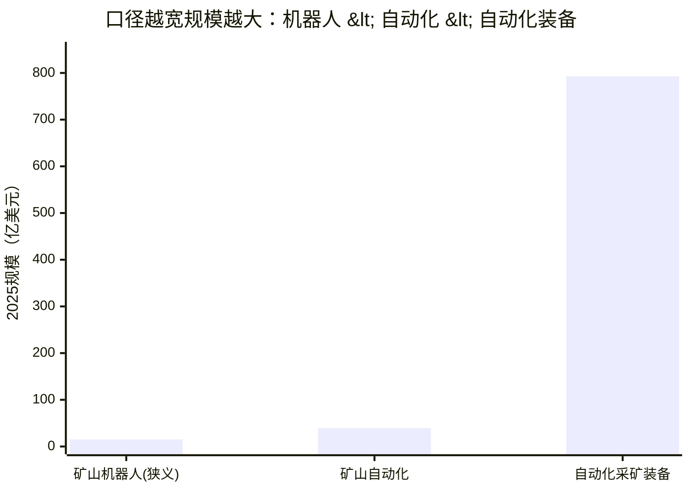

> 引用市场数据务必区分口径：狭义"矿山机器人"约 15 亿美元、CAGR 最高（14.5%）；最广义"自动化采矿装备"近 800 亿美元。

### 6.2 中国

**矿用机器人专项（人民币口径，据前瞻产业研究院/中国电子学会等第三方报告）**：

| 年份 | 矿用机器人市场规模 | 增速 |
|------|------------------|------|
| 2024 | 约 **24 亿元**（占特种机器人市场约 10%） | — |
| 2025E | 约 **28 亿元** | +17% |
| 2030E | 有望突破 **64 亿元** | 2025–30 CAGR **>18%** |

**更广义的"智慧矿山/煤矿智能化"市场**：
- 智慧矿山市场 2025 年预计突破 **670 亿元**，2035 年有望达 **1,200 亿元**；煤矿智能化设备市场 2025 年将突破千亿元。
- 按单矿智能化改造约 **2.06 亿元**测算，全国 2,000 座煤矿完成改造对应市场空间高达 **3,100 亿元**。
- 截至 2024 年 9 月，全国已建成智能化采掘工作面 **1,642 个**、有智能化工作面的煤矿达 **859 处**，智能化建设投资总规模近 **2,000 亿元**、已完成投资超 1,000 亿元。

**国际对照（美元口径）**：

| 口径 | 机构 | 数据 | 备注 |
|------|------|------|------|
| 矿山机器人 | 第三方聚合 | 2024 约 32 亿美元，CAGR 10.2% | 含金属矿/露天，可信度中 |
| 矿山自动化 | Straits Research | 2024 6.78 亿美元 → 2031 16.64 亿，CAGR 13.8% | — |
| 全球占比 | Fortune Business Insights | 中国 2026 约 13.7 亿美元，单一国家最大市场 | 矿山自动化口径 |

**图 9：中国煤矿机器人细分市场结构（按产品类型占比）**

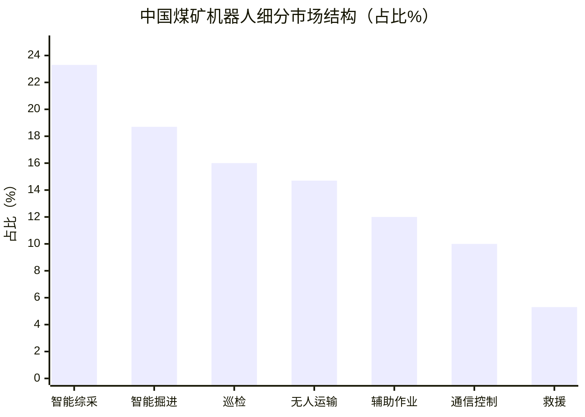

> 智能综采（23.3%）与智能掘进（18.7%）合计超四成，是价值量最大的两块；巡检（16%）最成熟；救援（5.3%）占比最小但战略价值最高。

> ⚠️ 口径与来源提示：人民币市场规模（24/28/64 亿元、670 亿元等）与细分占比来自第三方行业报告，**精度与口径未经官方核实**，宜作量级参考。已确认的**实物部署数据**（截至 2024.9：1,642 个工作面、2,640 台机器人、1.7 万岗位无人值守；2025.9：1,930 个工作面）可作为市场体量的实证支撑。

---

## 七、商业模式分析

| 模式 | 说明 | 主要采用方 |
|------|------|-----------|
| **整机销售** | 防爆特种装备一次性售予煤矿，单价高、认证门槛高 | 国内外主流（开诚、天玛、郑煤机；Sandvik、Komatsu 设备） |
| **EPC 总包/系统集成** | 智能化工作面成套技术装备（"中国模式"），按项目结算 | 国内集成商 |
| **租赁 / RaaS（机器人即服务）** | 从"租设备"转向"买效果/解决方案"；国内正从硬件租赁 1.0→全案交付 2.0→RaaS 3.0 演进 | 通用工业场景较多，井下因防爆/定制化渗透仍低 |
| **数据与软件订阅** | AI 大模型、数字孪生、智能管控平台 | 全球软件为增速最快子类；ANYbotics 走 Inspection-as-a-Service |
| **按工作面/吨煤付费、合资运营** | 头部煤业集团与装备商成立合资公司或共建基地 | 山西焦煤、宁夏煤业、国家能源集团等 |

**中外差异**：
- **海外**：以露天矿自动驾驶卡车（AHS）+ 车队管理软件订阅为主，自动化程度高、商业化成熟；商业模式趋势为"设备 + 自动化授权 + 数据/远程监控订阅 + 售后服务"。
- **中国**：以井工煤矿"少人化工作面 + 巡检/钻探/救援专用机器人"为特色，强政策驱动、强防爆约束，**整机销售 + 集成总包**为主（设备销售约占行业总收入 **60%–85%**）。

**典型定价（国内，第三方报告口径）**：

| 类别 | 单价/单套 |
|------|----------|
| 挂轨式巡检机器人 | 30–80 万元 |
| 轮式巡检机器人 | 40–100 万元 |
| 四足机器人 | 80–150 万元 |
| 智能综采控制系统 | 500–2,000 万元/套 |
| 智能掘进系统 | 1,000–3,000 万元/套 |
| 大型智能化改造总包 | 数千万至亿元级（如中信重工 1.2 亿元掘进机器人集群） |

**新兴模式落地实例**：
- **RaaS 按里程计费**：北路智控 2025 年启动"机器人即服务"，按巡检里程 **0.8 元/公里**收费；亦有按月/年订阅（设备+运维+数据分析全包）、按减人数量/效率提升的"按效果计费"。
- **EPC+O / 吨煤服务费**：将 CapEx 转为 OpEx，按产煤量收取服务费。
- **数据增值与大模型**：云鼎科技联合 **DeepSeek** 推出矿山大模型，接入山东能源集团知识库实现采掘方案智能优化；梅安森以设备数据沉淀提供订阅式服务。预计到 2026 年 **80% 以上**煤矿机器人将集成大模型能力。
- **融资租赁**：分期支付降低中小煤矿采购门槛。

**图 10：商业模式演进路径**

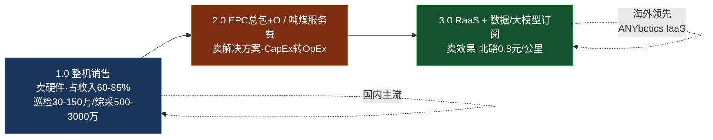

> 国内当前重心在 1.0→2.0，井下因防爆/定制化强，RaaS（3.0）渗透仍低；海外巡检场景已先行迈向 3.0。

---

## 八、趋势与前沿

**8.1 关键支撑技术**
- **5G 矿用专网 + 矿鸿 OS**：矿用 5G 专网已实现井下全覆盖，平均网络延时 **13ms**；华为**矿鸿操作系统（MineHarmony）**首次将分布式软总线"万物互联"用于井下，CCTEG 沈阳院推出全球首批矿鸿系统煤矿机器人群。
- **AI 大模型 + 边缘计算**：云鼎科技联合 DeepSeek 矿山大模型；北路智控"矿山鸿蒙 OS 机器人"算力 **32 TOPS**；预计 2026 年 80%+ 煤矿机器人集成大模型，实现故障预测、路径规划自主决策。
- **多传感器融合 + 混合定位**：激光雷达+红外热成像+气体检测的多模态融合实现甲烷 **0.1%** 精度、温度异常 0.5℃ 感知；北斗+UWB+SLAM 混合定位在井下无 GPS 环境达 **5cm 级**精度（科瑞激光雷达 0.1–200m、±2cm，抗粉尘/水雾）。
- **数字孪生**：CCTEG 太原院掘进工作面远程控制"太空舱"，实现"地面规划、装备自动执行、面内无人作业"。
- **防爆与本安核心部件（国产突破）**：埃斯顿 EX 系列防爆伺服 MTBF 达 **8,000 小时**（超标 30%）；汇川防爆电机防护等级 **IP68**，可在粉尘 ≥2,000mg/m³ 环境稳定运行；国产惯导（北斗天地 IMOSS）已常态化应用。
- **仿生形态**：四足、蛇形、六足机器人解决复杂地形与狭小空间探测难题。

**图 11：煤矿机器人"云-边-端"技术栈分层**

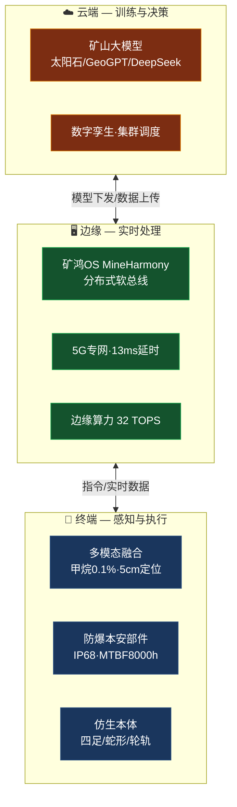

**8.2 演进方向**
1. **AI 大模型 + 煤矿**：行业专用大模型落地（CCTEG"太阳石"/GeoGPT；"AI+"能源 2027 目标 5 个以上能源大模型）。
2. **具身智能/人形机器人入井**：中国具身智能 2025 年单年约 70 亿美元投资、约 150 家人形机器人公司（优必选、智元 AgiBot、宇树）；**面向煤矿井下的防爆人形机器人尚处早期探索**，防爆认证是关键卡口。
3. **机器人集群协同**：从单台向"天-地-井"多机协同演进（CCTEG 沈阳院集群指挥调度系统），预计 2030 年成大型煤矿标配。
4. **云-边-端协同**：天地科技与华为合作"云-边-端"一体化（云端训练、边缘决策、终端执行）。
5. **氢燃料续航**：试验性搭载氢燃料电池，续航 **8→24 小时**，预计 2028 年成巡检机器人标配。
6. **电动化/零碳化、人机协作增强**：从"完全替代"走向"人机协作"，机器人担危险重复作业、人负责决策与异常处理。

---

## 九、行业挑战与机遇

**9.1 主要挑战**
- **技术瓶颈**：跨品牌设备数据协议兼容性不足（仅支持约 **60%** 主流品牌）；强电磁干扰下定位精度下降约 50%；直径 <1 米巷道探查、复杂地质导航与耐久性仍待突破；救援机器人受防爆/通信/续航限制，实战仍少。
- **成本压力**：中小型煤矿渗透率不足 **5%**；巡检机器人 30–150 万、综采系统 500–3,000 万，对中小煤矿投入大；即便有 15%–20% 补贴，ROI 回收期仍是决策关键。
- **标准与生态**：数据接口不统一、"信息孤岛"问题制约整体智能化；矿鸿 OS 或冲击既有软件生态，企业面临适配压力；统一安全标准与数据互通协议亟待建立。
- **人才短缺**：既懂机器人又懂煤矿现场的复合型人才严重短缺。
- **商业模式困境**：仍以一次性设备销售为主，"卖设备→卖服务/数据"转型尚在探索。

**9.2 发展机遇**
- **政策红利**：2026 年产能占比 ≥60%、减人 10% 的量化目标倒逼需求；产能核增/税收抵免/安全费列支等降低采购成本；山西、内蒙古补贴力度大。
- **国产替代**：天玛 LongWallMind 6.0、国产惯导/防爆伺服/矿用激光雷达突破，降低进口依赖。
- **出海广阔**：5G+北斗+复杂地质适应性为独特优势；易控智驾合作印尼 Adaro，北路智控 2024 出口 20 台（85 万/台，高于国内均价 68 万）；"一带一路"需求旺盛。
- **技术跨界 + 后市场**：预计 2030 年智能煤矿市场空间达 **1.4 万亿元**、巡检机器人需求 **40 万台**；运维/升级/数据服务等后市场毛利率高于设备销售。

---

## 十、关键结论与启示

1. **最确定的落地方向**：智能化综采（控制系统）+ 巡检机器人，已规模商用且有明确政策与安全 ROI 支撑。
2. **最高技术壁垒/差异化点**：**井下防爆 + 无 GPS 定位导航 + 复杂地形自主**。谁能率先把通用具身智能能力与防爆认证结合，谁就能打开掘进、救援等高价值场景。
3. **周期性风险**：煤矿机器人需求与煤炭行业资本开支强相关（天玛智控、龙软科技 2024–25 营收下滑为警示），需关注煤价与煤企 CapEx 周期。
4. **国际可借鉴**：Komatsu 长壁自动化的成套化、Sandvik/Epiroc 的 LHD 自主+遥操作+电气化组合、ANYbotics 的 Inspection-as-a-Service 商业模式，对国内厂商的产品化与商业模式升级有参考价值。
5. **潜在创业/投资机会**：①井下防爆具身智能本体；②井下定位导航/SLAM 中间件；③煤矿行业专用大模型与数据平台；④"机器人即服务"在巡检场景的渗透；⑤行业 CR10 仅约 20%，**并购整合**窗口open。
6. **核心风险提示**：煤炭周期波动、技术迭代颠覆、地方补贴可持续性、价格战、井下作业安全责任。

**图 12：产品形态成熟度阶梯（标注市场占比）**

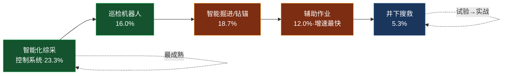

> 越靠左商业化越成熟、确定性越高；越靠右技术壁垒（防爆+自主）越高、潜在差异化空间越大。

---

## 十一、参考来源

**政策/官方**
- 国新办发布会（38 种 5 大类确认，2023.6）：http://english.scio.gov.cn/m/pressroom/2023-06/27/content_89649015_8.htm
- 国务院英文网（813 个工作面、29 种机器人/370+ 矿，2022.3）：http://english.www.gov.cn/statecouncil/ministries/202203/18/content_WS6233e377c6d02e5335327f02.html
- Global Times（494→1,930 工作面、事故 -29.7%，2025.9）：https://www.globaltimes.cn/page/202509/1344352.shtml
- Georgetown CSET（"AI+"能源实施意见，发改〔2025〕73 号）：https://cset.georgetown.edu/publication/china_ai_plus_energy_opinions_2025/
- 新华社英文（山西智能矿、用工 -40% 产量 +60%，2025.7）：http://english.news.cn/20250723/b892a259415246b8987e4dd0efba35e3/c.html
- 国家矿山安全监察局 + 工信部（矿山机器人应用验证试点通知·矿安综〔2026〕7 号，2026.5.20）：https://www.chinamine-safety.gov.cn/zfxxgk/fdzdgknr/tzgg/202605/t20260522_604631.shtml
- AAStocks 援引中银国际/摩根士丹利（留神峪"5·22"事故伤亡数据）：http://www.aastocks.com/sc/stocks/news/aafn-con/NOW.1526221/latest-news/AAFN

**国内企业**
- 国资委英文网（CCTEG 上海院钻锚机器人/东滩煤矿）：http://en.sasac.gov.cn/2025/06/06/c_19392.htm
- 国资委英文网（CCTEG 综述：战新 55%、10m 综采、太阳石/GeoGPT）：http://en.sasac.gov.cn/2026/01/12/c_20303.htm
- 中信集团 2024 年报（开诚特种机器人）：https://www.citic.com/ar2024/en/manufacturing/heavyindustries
- 天玛智控财务（stockanalysis）：https://stockanalysis.com/quote/sha/688570/
- 龙软科技财务（stockanalysis）：https://stockanalysis.com/quote/sha/688078/revenue/
- 郑煤机全球地位（新华社英文）：http://www.xinhuanet.com/english/2019-09/23/c_138414235.htm

**国际企业**
- Komatsu 煤炭长壁自动化：https://www.komatsu.com/en-us/newsroom/2024/komatsu-showcases-commitment-to-the-coal-industry
- Komatsu × CONSOL Energy NIOSH 奖：https://www.komatsu.com/en-us/newsroom/2018/2018-10-3-consol-energy-and-komatsu-receive-2018-noish-award
- Sandvik AutoMine Aura（2026.5）：https://www.mining.sandvik/en/news-and-media/news-archive/2026/05/sandvik-launches-automine-aura-a-first-of-its-kind-automation-platform-for-the-future-of-mining/
- Epiroc 2025 年报：https://www.epirocgroup.com/en/media/corporate-press-releases/2026/20260319-epiroc-publishes-2025-annual-and-sustainability-report
- Cat Command 累计 10 亿吨：https://www.mining.com/web/caterpillar-autonomously-hauls-more-than-1-billion-tonnes-of-material-with-cat-command-for-hauling-in-less-than-a-year/
- Boston Dynamics Spot @ LKAB：https://www.bostondynamics.com/resources/case-study/lkab-lulea-university-technology
- ANYbotics 融资 1.5 亿美元：https://theaiinsider.tech/2025/09/23/anybotics-total-funding-at-150-million-after-climate-investments-joins-to-scale-autonomous-inspection-in-hazardous-sites/
- Emesent Hovermap：https://www.emesent.com/industry/mining/
- Exyn Autonomy Level 4：https://www.exyn.com/news/exyn-drones-achieve-autonomy-level-4
- DARPA SubT 冠军：https://www.darpa.mil/news/2021/subterranean-challenge-winners

**市场规模**
- Fortune BI 矿山机器人（15.1→50.8 亿，CAGR 14.5%）：https://www.fortunebusinessinsights.com/mining-robotics-market-116024
- MarketsandMarkets 矿山自动化（39.6→59.3 亿）：http://marketsandmarkets.com/Market-Reports/mining-automation-market-257609431.html
- Mordor 自动化采矿装备（792.6→1423 亿）：https://www.mordorintelligence.com/industry-reports/automated-mining-equipment-market
- Straits Research 中国矿山自动化：https://straitsresearch.com/vertex/insights/mining-automation-market/china

---

## 附：调研局限说明

1. **中文一手来源受限**：本轮检索中文搜索大量返回 CNKI 学术论文与 SEO 聚合页，部分国内公司（精英数智、华洋通信、石煤机等）的具体产品型号、营收、案例未能用权威来源核实，报告中已明确标注，未作臆造。
2. **第三方报告数据需谨慎引用**：本报告人民币市场规模（24/28/64 亿元、智慧矿山 670 亿元、智能煤矿 1.4 万亿元等）、细分占比、各家市占率（如开诚 22.8%、北路智控 28%、SAM 25.4%、郑煤机液压支架 >60%）及产品定价，均来自用户提供的第三方行业报告，**口径与统计时点不一、未经官方/财报交叉核实**，宜作量级与相对位次参考。其中郑煤机液压支架市占率存在"约 25%（2010–11 历史）vs >60%（2024 第三方）"的显著口径差异，已在正文标注。
3. **建议补充渠道**：巨潮资讯网（cninfo，上市公司公告与年报）、公司官网、中国煤炭网/煤炭工业网、天眼查/企查查；前瞻/头豹付费报告核实专项规模与市占率。
4. **落地 vs 试验**：已明确区分商用落地（CCTEG 钻锚机器人、天玛综采、郑煤机支架、开诚消防/巡检、Komatsu 长壁、Sandvik AutoMine）与研发/试验（瓦斯防突钻孔机器人等）；救援机器人已于 2026.5 留神峪事故首次实战，处于"试验→实战"过渡。

---

返回 [[00.临时文档/README\|README]] ｜ 全局地图 [[知识图谱与索引\|知识图谱与索引]]
